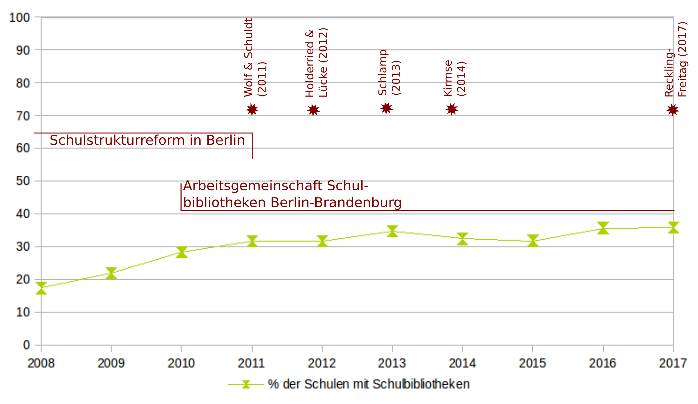

### Einleitung: Motivation der Studie

Im Rahmen seiner Magisterarbeit erhob der Autor dieses Textes 2006 –
über eine Recherche auf den Homepages aller Schulen in Berlin – die Zahl
der Berliner Schulbibliotheken und ihrer Verteilung unter den zu diesem
Zeitpunkt in Berlin existierenden Schulformen. (Schuldt 2006) Damals
zeigte sich, dass nur eine kleine Anzahl von Schulen (78 von 878)
angaben, über eigene Bibliotheken zu verfügen. Gleichzeitig stand das
Schulsystem des Bundeslandes Berlin vor einer grossen
Schulstrukturreform, die unter anderem Einfluss auf die Entwicklung der
Schulbibliotheken hätte haben können. (Maaz et al. 2013) Nicht zuletzt
wurde während der Magisterarbeit klar, dass bislang für
Schulbibliotheken in Deutschland immer nur einzelne Einrichtungen
untersucht oder aber Überblicke zu einem bestimmten Zeitraum, also
Momentaufnahmen, erarbeitet wurden. Es gab aber keine Untersuchung über
die Entwicklung von Schulbibliotheken über einen längeren Zeitraum.[^1]

Schulbibliotheken haben die Eigenschaft, institutionell unklar verortet
zu sein. In der Magisterarbeit wurden (für Berlin) vier Gruppen
identifiziert, die Einfluss darauf haben, was Schulbibliotheken sind,
wie sie ausgestattet und wofür sie genutzt werden, nämlich (1)
Lehrpersonen und Schuldirektionen, (2) Bibliothekarinnen und
Bibliothekare (ausserhalb der Schulen), (3) Eltern und Ehrenamtliche –
oft Lesepatinnen und Lesepaten – und (4) Schülerinnen und Schüler.
(Schuldt 2010:10-12) Diese vier Gruppen haben sehr unterschiedliche
Vorstellungen davon, wie diese Bibliotheken funktionieren sollen.
Insoweit ist es schwer, ein Konzept von Schulbibliotheken zu
identifizieren, das von allen geteilt würde. Eher lassen sich
Schulbibliotheken als "Boundary Objects" – Konzepte oder Objekte, welche
von unterschiedlichen Communities of Practice genutzt, in ihre jeweilige
Praxis integriert und gleichzeitig von ihnen unterschiedlich verstanden
werden – beschreiben. Das macht Schulbibliotheken als
Untersuchungsgegenstand auch über eine Studienabschlussarbeit hinaus
interessant und damit auch die Frage, wie sie sich über einen längeren
Zeitraum entwickeln, weil sie offenbar ein Ergebnis von Möglichkeiten,
Infrastrukturen und wahrgenommenen Bedürfnissen sind, die lokal aus sehr
unterschiedlichen Communities und Gegebenheiten heraus entstehen (und
deshalb zum Beispiel nicht einfach mit der Veränderung eines Kriteriums,
wie einer neuen Werbestrategie des Bibliothekswesens für
Schulbibliotheken, die es von Zeit zu Zeit gibt, zu erklären sind).

2008 wurde deshalb vom Autor dieses Textes das Projekt begonnen, über
zehn Jahre hinweg Daten zur Entwicklung der Schulbibliotheken in Berlin
zu sammeln und mit diesen Daten Thesen über deren Entwicklung zu
überprüfen, die deduktiv aus den in der Magisterarbeit gesammelten
Erfahrungen (und der weiteren Literaturarbeit, die im Rahmen der
Promotion des Autors geleistet wurde) entstanden waren. Die Hoffnung
war, mit diesem Vorgehens verlässlichere Aussagen über die weitere
Entwicklung, aber auch über die unterschiedlichen Quellen zu gewinnen,
die zur Gründung, den Betrieb oder die Schliessung von Schulbibliotheken
(in deutschen Schulsystemen) führen.[^2]

Der vorliegende Text berichtet über die Ergebnisse dieses Projektes. Im
folgenden Kapitel (2) werden die Thesen des Projektes präsentiert und
begründet sowie die Methode der Datenerhebung vorgestellt. Anschliessend
werden die erhobenen Daten über die Verteilung der Schulbibliotheken in
Berlin präsentiert (3). Mit diesen Daten werden die aufgestellten Thesen
überprüft (4) und die Ergebnisse dieser Überprüfung diskutiert (5).
Daran schliesst eine Einschätzung dazu an, welche Bedeutung die
Ergebnisse des Projektes für Schulbibliotheken, Schulen und das
Öffentliche Bibliothekswesen haben (6). Vor dem Fazit (7) werden
mögliche weitere Forschungsfragen zu Schulbibliotheken, die sich aus
diesem Projekt ergeben, genannt.

Grundsätzlich zeigen die erhobenen Daten, dass Schulbibliotheken
tatsächlich als Einrichtungen zu verstehen sind, die an den lokalen
Schulen und deren jeweiligen Entwicklungen orientiert sind.
Bibliothekarische Hoffnungen darauf, Schulbibliotheken prinzipiell als
Teil des Bibliothekswesens verstehen und integrieren zu können, die seit
einigen Jahrzehnten die bibliothekarische Diskussion bestimmen (siehe
als Beginn des Diskurses Doderer et al. (1970); die Hoffnungen werden
aber weiterhin formuliert, in der Schweiz sogar in eigenständigen
Richtlinien, siehe Schweizerische Arbeitsgemeinschaft der allgemeinen
öffentlichen Bibliotheken (2014)), sind deshalb zurückzuweisen. Aktuell
scheinen Schulbibliotheken stattdessen, teilweise sehr kontinuierlich,
zumeist ein Eigenleben mit Bezug auf den Kontext ihrer jeweiligen
Schulen zu führen.

### Thesen zur Entwicklung der Schulbibliotheken in Berlin und Methode der Datenerhebung

Das hier dargestellte Projekt wurde, um zu neuen Ergebnissen zu
gelangen, welche über die auf einen Zeitpunkt bezogenen
Zustandsbeschreibungen von Schulbibliotheken hinausgehen, als
längerfristige, thesengeleitete Forschung konzipiert. In diesem Kapitel
wird die Thesenbildung erläutert (2.1), anschliessend die verwendete,
eher einfache Methode der Datenerhebung (2.2) und zuletzt diskutiert,
welche Fragen sich mit den erhobenen Daten zusätzlich zur Prüfung der
aufgestellten Thesen bearbeiten lassen (2.3).

#### Thesenbildung

Wie berichtet wurden 2006 in nur wenigen Schulen in Berlin
Schulbibliotheken vorgefunden, obgleich in der bibliothekarischen
Literatur seit Jahrzehnten postuliert wurde, dass jede Schule von einer
eigenen Bibliothek profitieren würde. (Schuldt 2006, die dort angegebene
Literatur ist in den letzten Jahren gewachsen, hat sich inhaltlich aber
kaum verändert.) Obwohl in den Schulbibliotheken, die 2006 im Rahmen der
Magisterarbeit besucht wurden, viel engagiertes Personal angetroffen
wurde, dass jeweils selber Gründe dafür angab, warum ihre Einrichtungen
vorteilhaft für die jeweilige Schule wäre, schien doch die Erfahrung
auch ständig von wieder geschlossenen Schulbibliotheken zu hören[^3] und
die geringe Verbreitung von Schulbibliotheken im Allgemeinen die These
nahezulegen, dass immer nur eine kleine Zahl von Schulen in Berlin auch
Bibliotheken haben werden. Hieraus ergab sich folgende These:

**These 1: Schulen mit Schulbibliotheken werden in Berlin auch in Zukunft
in der Minderheit bleiben.**

In den 2006 erstellten Daten fand sich eine im deutschen Schulsystem zu
erwartende Schieflage. In den damals fünf unterschiedlichen Schulformen
mit Sekundarstufe – Hauptschule, Realschule, Gymnasium, Gesamtschule,
Sonderschule – betrieben Gymnasien weit eher Schulbibliotheken (24,6%),
als – in dieser Reihenfolge – Gesamtschulen (9,9%), Realschulen (8,3%),
Hauptschulen (1,7%, genau eine) und Sonderschulen (0%, also keine). In
der bibliothekarischen Literatur werden Schulbibliotheken vor allem mit
der Leseförderung in Verbindung gebracht, insoweit hätte das Ergebnis
auch anders aussehen können. Gerade die Schulen mit "schwachen"
Leserinnen und Lesern hätten mehr Schulbibliotheken erwarten lassen
können. (Auch in Grundschulen, in denen das Lesen ja erlernt wird,
liessen sich nur in 8,3% Schulbibliotheken finden.) Der Eindruck war
jedoch, dass die Stratifizierung des deutschen Schulsystems sich auch
bei der Verteilung von Schulbibliotheken fortsetzte. Die Schülerinnen
und Schüler, die von den Chancen und der Ausstattung her ehedem
bevorzugt waren, hatten auch eine höhere Chance, auf Schulbibliotheken
zurückgreifen zu können.[^4]

Angesichts dessen, dass diese Ungleichheit in der infrastrukturellen
Ausstattung von Schulformen seit Jahrzehnten beklagt wurde, lag die
Vermutung nahe, dass sie in Bezug auf Schulbibliotheken ebenso nicht nur
zufällig beim Zeitpunkt der Recherche bestand, sondern strukturell
produziert war und auch weiterhin produziert wird. Dies ist in der
folgenden These postuliert:[^5]

**These 2: In Bezug auf Schulbibliotheken bleiben die Gymnasien den
anderen Schulen mit Sekundarstufen gegenüber überausgestattet.**

Im Anschluss an die intensiven Debatten, die als Reaktion auf die ersten
Runden der PISA-Studien in Deutschland geführt wurden, fand in Berlin
eine Schulstrukturreform statt, die zum Beispiel eine andere Form von
Steuerung der Schulen erprobte.[^6] Die gravierendste Änderung stellte
die Zusammenführung von Haupt-, Real- und Gesamtschule zur neuen
Schulform "Integrierte Sekundarschule" dar. Diese Schulform ermöglicht
den Erwerb aller Schulabschlüsse, inklusive – nach 13 Jahren – des
Abiturs. Sie soll die Chancengleichheit erhöhen, da hier alle
Schülerinnen und Schüler eine praktische Chance zum Abitur (oder den
ihnen entsprechenden Bildungsabschluss) haben sollen und nicht mit der
Differenzierung nach der Grundschule (in Berlin in der siebenten Klasse)
praktisch schon festgelegt werden. Gleichzeitig wurde das Gymnasium auf
12 Jahre verkürzt und der Übergang von der Grundschule auf das Gymnasium
nach der vierten Klassen normalisiert.[^7]

Neben der Schulstrukturreform liefen Bemühungen, Sonderschulen – jetzt
"Schule mit Förderschwerpunkten" – abzubauen und durch integrativen
Schulalltag – in welchem Kinder und Jugendliche mit und ohne gesonderten
Förderbedarfen möglichst gemeinsam unterrichtet werden – in Schulen ohne
gesonderte Förderschwerpunkte umzuwandeln.

Diese Veränderung führte, wie 2008 schon abzusehen war, zu massiven
Veränderungen in der Berliner Schullandschaft. Integrierte
Sekundarschulen wurden zum Beispiel oft geschaffen, indem je eine Haupt-
und Realschule zu einer neuen Schule zusammengefasst wurden, was die
Zahl der Schulen in Berlin reduzierte. Gleichzeitig war absehbar, dass
zumindest die Auswirkungen dieser Veränderung auf die Schulen und den
Schulalltag mit der Zeit wieder in einen unaufgeregten Alltag übergehen
würden.

Allerdings konnte man annehmen, dass sich im Rahmen dieser Verfahren, in
denen Schulen und Schulgemeinschaften aufgefordert wurden, die
Entwicklung in ihren (zum Teil neuen) Schulen selbstständig
voranzutreiben, einen ganze Reihe von Projekten in Bezug auf
Schulbibliotheken entstehen würden. Die Idee, zumindest in einer
schuleigenen Form eine Bibliothek zu gründen, liegt nahe, wenn eine
Schule aufgefordert wird, neue Einrichtungen und Schulpraxen zu
entwerfen.[^8] Gleichzeitig ist aus der Geschichte von Schulreformen in
Deutschland und deren Langzeitwirkung – auch in Bezug auf
Schulbibliotheken – eher Zurückhaltung bei weitreichenden Hoffnungen auf
grundlegende Änderungen angeraten. Deshalb wurden folgende Thesen
aufgestellt:

**These 3: Die Schulstrukturreform wird kurzfristig zu einem Anstieg der
Zahl von Schulbibliotheken führen, die mittelfristig wieder auf das
Niveau vor der Reform sinken wird.**

**These 3a: Dies wird insbesondere für die neu geschaffene Schulform
Integrierte Sekundarschule gelten.**

In der bibliothekarischen Literatur werden Schulbibliotheken seit den
1970er Jahren als multifunktional zu nutzende Einrichtungen – als
Informationszentren, als Lernort für einzelne Schülerinnen und Schüler
oder für Gruppen, als Unterrichtsort für Schulklassen, als Ort für das
freie Lesen, für Hausarbeiten und für die Freizeitnutzung – beschrieben;
aus dieser Beschreibung wird abgeleitet, dass eine professionelle
bibliothekarische Betreuung notwendig sei. Unter den Schulbibliotheken,
die 2006 auf den Homepages der Schulen vorgefunden wurden, fanden sich
zwar einige wenige, die offenbar diese Ansprüche teilten. (Schuldt 2006)
Hauptsächlich wurden in den Schulen, bei denen dies genauer dargestellt
wurde, die Bibliothek aber vorrangig als Ort für das Lesenlernen
verstanden. Dies deckte sich auch mit den wenigen Äusserungen zu
Schulbibliotheken, die sich in der pädagogischen Literatur fanden. Diese
Situation scheint schon länger zu existieren; zumindest hat sich die
Argumentation in der bibliothekarischen Literatur für die
multifunktionalen Schulbibliotheken seit den 1970er Jahren kaum geändert
(Doderer et al. 1970), ohne dass diese Einfluss auf die Schulbibliothek
gehabt zu haben scheint. Aus dieser Überlegung ergab sich die folgende
These:

**These 4: Die Bibliotheken in Schulen werden weiterhin hauptsächlich als
"Lesebibliotheken" verstanden und genutzt.**

Wie erwähnt, entstand während der Magisterarbeit der Eindruck, dass
Schulbibliotheken in Berlin eher diskontinuierlich betreiben werden. Es
wurden kaum Schulen gefunden (und mit Spandau auch nur in einem der
zwölf Berliner Bezirke), in denen 2006 Öffentliche Bibliotheken Filialen
betrieben (was Jahre vorher noch verbreitet war, vergleiche Senator für
kulturelle Angelegenheiten (1988/1990)[^9]). Von Seiten des
Bibliothekswesens wurde also keine Kontinuität hergestellt. Vielmehr
entstand der Eindruck, dass in vielen Schulen die Bibliothek vom
Engagement einzelner Lehrkräfte, Eltern, Ehrenamtlichen und zum Teil
Schülerinnen und Schülern abhing. Nur ganz wenige Schulen übernahmen zum
Beispiel die Verantwortung, Personal für die Schulbibliothek direkt
einzustellen und langfristig zu finanzieren.[^10] Ein solches
ehrenamtliches Engagement kann aus unterschiedlichen Gründen zurückgehen
(Pensionierung, Übernahme anderer Aufgaben, die Lernenden selber oder
die Kinder der engagierten Eltern verlassen die Schule etc.), die oft,
strukturell ähnlich, in vielen Schulen zu finden sind. Schulen stellen
strukturell offenbar auch keine Kontinuität bei der Betreuung der
Schulbibliotheken her. Eine solche Kontinuität wäre aber einen
Voraussetzung für das Entstehen eines Netzwerks von Schulbibliotheken,
die sich professionell entwickeln, gemeinsam Ziele definieren und
Erfahrungen austauschen, also zu einer zusammenhängenden
Schulbibliothekslandschaft werden könnten. Insoweit wurde folgende These
formuliert:

**These 5: Der Grossteil der Schulbibliotheken in Berlin wird
diskontinuierlich betrieben.**

Während beim Beginn des Projektes bekannt war, dass im Berliner
Schulwesen Strukturreformen stattfinden würden, war nicht ersichtlich,
dass in der Laufzeit des Projektes in kurzer Folge aus dem
Bibliothekswesen heraus drei als Handbücher zu Schulbibliotheken
konzipierte Monographien erscheinen würden (Wolf & Schuldt 2011;
Holderried & Lücke 2012; Kirmse 2014)[^11] sowie eine Monographie aus
dem schulischen Zusammenhang, die für eine pädagogische Nutzung der
Bibliothek plädierte (Schlamp 2013). Solche (deutschsprachigen) Werke
waren zuletzt in den 1980er Jahren (Papendieck & Hoebbel 1985)
erschienen. Ebenso war nicht vorherzusehen, dass 2010 einen
Arbeitsgemeinschaft Schulbibliotheken Berlin-Brandenburg gegründet
würde. (Zu deren Wirken siehe Abschnitt 3.2.) Die als Vorbild dienende
Landesarbeitsgemeinschaft Schulbibliotheken in Hessen existiert schon
seit 1987, hätte also schon viel früher "kopiert" werden können.[^12]

Ebenso nicht vorherzusehen war die Entwicklung im Bezirk
Treptow-Köpenick, wo beim Schulamt eine feste Stelle für
schulbibliothekarische Arbeit geschaffen wurde – allerdings mit wenig
Etat –, die seitdem kontinuierlich für Schulbibliotheken im Bezirk aktiv
sein kann.

All diese Entwicklungen geschahen mit den Anspruch, die
Professionalisierung der Schulbibliotheken voranzutreiben. (Dies wird
zum Beispiel in den Vorworten der vier Publikationen jeweils betont.)
Bezogen auf die Entwicklung der Schulbibliotheken in Berlin, die im hier
präsentiert Projekt interessierten, wäre zu erwarten, dass sich diese
Publikationen und die Gründung der Arbeitsgemeinschaft auch in der Zahl
und Organisation von Schulbibliotheken niederschlagen würden.
Gleichzeitig war auch Vorsicht geboten angesichts der Geschichte von
grösseren Interventionen im Bereich Schulbibliotheken und Publikationen,
die seit den 1970er Jahren mit ähnlichen Ansprüchen, wie sie in den
Monographie vertreten wurden, antraten, aber deren Wirkung zum Beispiel
in der Magisterarbeit 2006 nicht (mehr) nachzuweisen waren. (Schon
einmal diskutiert in Schuldt (2012).) Insoweit wurde sich nachträglich –
nachdem das Projekt schon gestartet war – für eine positive These
entschieden, obwohl eher erwartet wurde, dass sie am Ende widerlegt[^13]
würde:

**These 6: Die neue Literatur zu Schulbibliotheken, die
Arbeitsgemeinschaft Schulbibliotheken Berlin-Brandenburg sowie die
Stelle für schulbibliothekarische Arbeit in Treptow-Köpenick werden sich
in einer steigenden Anzahl von Schulbibliotheken in Berlin sowie in
Schulbibliotheken, die sich eher am "bibliothekarischen Modell"
orientieren, niederschlagen.**

#### Methodik

Zum Test der aufgestellten Thesen ist eine Übersicht zur Zahl und
Verteilung der Schulbibliotheken in Berlin, inklusive – für den zweiten
Teil der sechsten These – eine genauere Darstellung der Konzepte, denen
in den Schulbibliotheken gefolgt wird, mithin also eine kontinuierlich
geführte Schulbibliotheksstatistik, notwendig. Bislang gab es eine
solche Statistik nicht. Weder die Berliner Schulverwaltung, noch das
Landesamt für Statistik, noch eine andere Einrichtung – zum Beispiel die
Öffentlichen Bibliotheken – erheben kontinuierlich Daten zu
Schulbibliotheken. Es existiert zum Beispiel ein Schulverzeichnis, dass
kontinuierlich mit Daten zur Entwicklung der Schulen in Berlin (unter
anderem der Zahl der Schülerinnen und Schüler oder der Ausstattung der
Schulen) ergänzt wird.[^14] Zudem wird jährlich eine Bildungsstatistik
des Landes Berlin erhoben und zumindest in ihren Eckdaten
publiziert.[^15] Beide enthalten aber keine Angaben zu
Schulbibliotheken.

In einigen Fällen werden in Umfragen, die in Schulen durchgeführt
werden, auch Angaben zu Schulbibliotheken abgefragt, beispielsweise bei
den PISA-Studien 2009 (OECD 2011:89[^16]) oder der Studie
"Nutzungsmonitoring für Bibliotheken" (Hardtke-Flodell & Puchta 2015).
Diese eignen sich aber aus mehreren Gründen nicht für einen Test der
aufgestellten Thesen. Zum einen werden sie unregelmässig durchgeführt
(zumindest in Bezug auf Fragen zu Schulbibliotheken), beziehen sich auf
unterschiedliche Themen, ziehen unterschiedliche Zahlen von Schulen mit
ein und lassen sich so auch nicht vereinheitlichend in eine
kontinuierliche Datenreihe integrieren. Zum anderen verzichten sie aber
auch auf eine Definition, was unter Schulbibliotheken zu verstehen sei,
zum Beispiel ob sie von Sammlungen von Klassensätzen von Lehrbüchern,
die manchmal als Bücherei bezeichnet wird, abzugrenzen seien oder nicht.
Insbesondere Fragen zur Entwicklung der Zahl von Schulbibliotheken
lassen sich deshalb mit ihnen nicht beantworten.

Im hier vorgestellten Projekt wurden deshalb, mit sehr begrenzten
Mitteln, selber eine solche kontinuierliche Schulbibliotheksstatistik
für Berlin für einen Zeitraum von zehn Jahren (2008-2017) erstellt, mit
der jetzt die genannten Thesen getestet werden können.

Die Daten dazu wurden nicht durch Umfragen erhoben. Dies wäre ökonomisch
und vom Aufwand her nicht möglich gewesen.[^17] Vielmehr baute die
Studie, wie schon die Magisterarbeit von 2006, auf den Homepages der
Schulen und ihren dort dargebotenen Selbst-Präsentationen auf. Dies war
auch möglich, da die Schulen in Berlin dazu angehalten werden, sich nach
aussen zu präsentieren und dies 2008 auch schon taten.[^18]

Bei der Datenerhebung wurde wie folgt vorgegangen:

1.  Jährlich wurden in der ersten Aprilwoche im offiziellen
    Schulverzeichnis des Landes Berlin die vorhandenen Schulen
    recherchiert. Diese Liste veränderte sich von Schuljahr zu
    Schuljahr, teilweise durch Schliessungen, Eröffnungen (Neu- und
    Wiedereröffnung) von Schulen, teilweise durch das Zusammenlegen
    oder Trennen von Schulen (zumeist durch Abstufung zu Filialen oder
    Aufwerten von Filialen zu vollständigen Schulen). Gerade durch die
    Schulstrukturreformen, die während der Laufzeit des Projektes
    durchgeführt wurden (siehe Abschnitt 2.1), kam es zu massiven
    Veränderungen der Berliner Schullandschaft. Um die Arbeit zu
    begrenzen, wurden nur die Schulen des ersten Bildungsweges, die zu
    einem Schulabschluss führen, betrachtet. Berufsschulen,
    Abendschulen und Kolleges wurden nicht einbezogen. Ebenso nicht
    aufgenommen wurden ausländische Schulen, die keine deutschen
    Schulabschlüsse anbieten (diese sind auch gar nicht im
    Schulverzeichnis enthalten), einbezogen wurden aber Schulen mit
    einem deutschem und einem anderen Schulabschluss sowie
    Ersatzschulen, die allgemeine Schulabschlüsse anbieten –
    sogenannte Privatschulen –, egal welcher Ausrichtung. Die freien
    Waldorfschulen wurden, da sie im Schulverzeichnis gesondert
    gezählt werden, ebenso gesondert gezählt.

2.  Im Anschluss, dass heisst immer noch zu Beginn des jeweiligen
    Aprils, wurden die Homepages aller dieser Schulen aufgerufen und
    daraufhin durchsucht, ob eine Schulbibliothek erwähnt wurde.[^19]
    Dies geschah oft nur sehr kurz, zum Beispiel als ein Anstrich
    unter "Ausstattung" oder als Bild in einer Bilderstrecke aus der
    jeweiligen Schule; in anderen Fälle aber auch sehr umfangreich,
    mit eigenen Unterseiten für Schulbibliotheken oder auch eigenen
    Homepages der Schulbibliothek.[^20] Dabei wurden relativ liberale
    Kriterien angelegt. Wenn eine Schulbibliothek genannt wurde, wurde
    sie als existent angenommen. Ausgeschlossen wurden nur
    Einrichtungen, die erkennbar reine Sammlungen von Klassensätzen
    darstellten (da diese keine Funktion als Bibliothek für die
    Schülerinnen und Schüler bieten), oder aber, wenn die letzte
    Meldung zu einer Schulbibliothek drei oder mehr Jahre
    zurücklag.[^21] Die Studie nutzt also die Eigendefinition der
    Schulen – wenn diese eine Einrichtung als Schulbibliothek
    beschrieben, dann wurde sie als solche gezählt.[^22] Die
    Plausibilität der Angaben wurde, so weit möglich, überprüft – zum
    Beispiel ob es wirklich die aktuelle Homepage der genannten Schule
    (und nicht eine "aufgegebene" Homepage oder aber eine gleich
    benannten Schule in einem anderen Bundesland) war. Anschliessend
    wurde der Nachweis in einer Liste verzeichnet und, wenn möglich,
    die jeweilige Fundstelle als Snapshot abgespeichert.

3.  Die gesammelten Daten wurden jährlich deskriptiv ausgewertet. Sie
    stellten jeweils einen Querschnitt pro Jahr dar. Sicherlich sind
    diese Zahlen mit Vorsicht zu interpretieren. Die Homepage einer
    Schule stellt nie die gesamte Schule dar, sondern im besten Falle
    das, was die jeweilige Schule von sich nach aussen präsentieren
    möchte. Es ist allerdings zu vermuten, dass Schulbibliotheken, die
    eine Rolle im Schulalltag spielen, auf diesen Homepages genau
    deshalb dargestellt werden. Sind sie nur existent, ohne eine Rolle
    im Schulalltag zu spielen, werden sie wohl auch nicht nach aussen
    präsentiert. Schwieriger scheint die Frage, ob Schulbibliotheken,
    die geschlossen wurden, auch von den Homepages entfernt werden.
    Hier ist nicht zu erwarten, dass sie sofort verschwinden. Die
    Schliessung selber wird nur sehr selten auf der Homepage
    vermeldet.[^23] Ebenso, wie zu vermuten ist, dass nicht alle
    existenten, sondern nur die im Schulalltag relevanten Bibliotheken
    auf den Schulhomepages aufgeführt werden, ist auch zu vermuten,
    dass Schulhomepages Bibliotheken anzeigen, die real geschlossen
    sind. (Allerdings ist zu bemerken, dass die Homepages von Schulen
    mindestens einmal im Jahr – zum Beginn des Schuljahres –
    aktualisiert werden, oft auch regelmässiger.) Hinzu kommt, dass
    jedes Jahr zwischen 10 und 20 Schulen im April keine aktuellen
    Homepages haben. Nichtsdestotrotz sind die erhobenen Daten als
    Annäherung an die Realität zu verstehen, für die es sonst keine
    besseren Daten gibt.

4.  Die Anzahl der Schulbibliotheken lässt sich, durch die regelmässig
    gleiche Form der Datenerhebung, direkt in Verbindung setzen. Die
    so entstanden Zeitreihen vermitteln allerdings schnell den
    Eindruck, als gäb es einen direkten Zusammenhang zwischen diesen,
    so als ob sich Schule A entscheiden würde eine Schulbibliothek
    einzurichten, weil Schule B und C eine unterhalten. Davon ist aber
    nicht auszugehen. Die Gründe dafür lassen sich nicht einfach aus
    der Datenreihe ableiten. Die Schulen entscheiden sich jeweils
    eigenständig dafür, Schulbibliotheken (in jeweils selbst gewählter
    Form) einzurichten – selbst wenn das Einrichten selber zum
    Beispiel vom Förderverein der Schule übernommen wird – oder auch
    wieder zu schliessen. Gleichzeitig implizieren die Datenreihen,
    zumindest zwischen 2008 und 2017, dass es fast immer nur neue
    Schulbibliotheken geben würde, dass also eine Schule, wenn sie
    eine Schulbibliothek eingerichtet hat, diese auch behalten würde,
    und nur einfach neue hinzukommen würden. Dem ist aber nicht so.
    Vielmehr ist die Verteilung der Schulbibliotheken über die
    Berliner Schulen viel diverser. Dies zeigt sich aber erst durch
    einen genaueren Blick in die Daten.

5.  Um diese Dynamik zu untersuchen, wurden in einer Datenbank alle
    Schulen in Berlin, die im Zeitraum von 2008 bis 2017 eine
    Schulbibliothek ausgewiesen hatten, inklusive der Jahre in denen
    sie dies taten, eingetragen. So wurden Kontinuitäten und
    Diskontinuitäten sichtbar. Allerdings galt, wie schon erwähnt, zu
    beachten, dass auch die Berliner Schullandschaft selber
    kontinuierlich in Bewegung ist, insbesondere – durch die
    Schulstrukturreformen – in den Jahren 2010 und 2011. Eine
    Schulbibliothek kann auch deshalb geschlossen werden, weil die
    jeweilige Schule mit einer anderen vereinigt wird, was wenig über
    die mögliche Kontinuität der Bibliothek selber aussagt; Schulen
    können umbenannt werden, was den Eindruck vermitteln kann, dass
    eine Schulbibliothek geschlossen und eine andere eröffnet wurde,
    obwohl es sich um die gleiche Einrichtung handelt. Es wurde
    versucht, auf diese potentiellen Fehlerquellen zu achten.[^24]

6.  Während bislang die jeweilige Situation deskriptiv dargestellt
    werden konnte,[^25] ab 2010 auch als Trend (Schuldt 2010), scheint
    jetzt, nach zehn Jahren, ein Grad der Sättigung erreicht zu sein,
    um die zu Beginn des Projektes aufgestellten Thesen überprüfen zu
    können. Alle Thesen lassen sich operationalisieren in zu erwartete
    Trends, die sich in den Daten zeigen müssten. Dies wird geschehen
    (4), nachdem die konkreten Daten dargestellt wurden (3).

#### Weitere Möglichkeiten, die Datensammlung zu verwenden

Die Sammlung auf Hinweise auf und Darstellung von Schulbibliotheken auf
den Homepages Berliner Schulen über einen Zeitraum von zehn Jahren
ermöglicht die Untersuchung weiterer Fragen, die über den Test der
genannten Thesen hinausgeht. Dabei ist nochmal anzumerken, dass über die
gesamten Jahre hinweg die meisten Schulen ihre Bibliotheken nicht
gesondert präsentierten, sondern nur kurz in Listen und Aufzählungen
anführten. Dies änderte sich auch nicht grundsätzlich durch den
Wettbewerb "Schulbibliothek des Jahres", den die Arbeitsgemeinschaft
Schulbibliotheken Berlin-Brandenburg seit 2011 alle zwei Jahre für
Berlin (und gesondert für Brandenburg) ausschreibt. (Siehe Abschnitt
3.2)[^26] Insoweit wäre zum Beispiel eine qualitative Inhaltsanalyse
dieser Darstellungen nur von begrenztem Aussagewert. Über die meisten
Schulbibliotheken (und Schulen) wäre damit weiterhin nichts ausgesagt.

Ebenso ist, wie schon gesagt, die Darstellung der Schulbibliotheken
nicht mit der Realität in den Bibliotheken selber gleichzusetzen. Zu
wünschen wäre mehr Forschung in den Einrichtungen selber; dies konnte im
Rahmen dieses Projektes nicht geleistet werden.

Zu Beginn des Projektes wurde sich erhofft, dass sich durch den langen
Zeitraum der Recherchen auch spezifische Angaben zu Schulbibliotheken
finden würden – beispielsweise zur Bestandsgrösse, zur Auswahl der
Medien, zum Etat, zum Personal –, die sich vergleichen oder – wie es
durch die Jahresberichte der Öffentlichen und Wissenschaftlichen
Bibliotheken möglich ist – über die Jahre hinweg verfolgt werden
könnten. Diese Daten fanden sich aber nur in Ausnahmefällen und auch
dann nicht kontinuierlich geupdatet. Insoweit lassen sich aus ihnen
keine Aussagen ableiten.[^27]

Diesen Einschränkungen eingedenk lassen sich an das gesammelte Material
folgende Fragen stellen, die in weiteren Auswertungen angegangen werden:

1.  Wie werden die (wenigen) genauer dargestellten Bibliotheken
    präsentiert? Was ist deren vermeintliche Funktion? Welche
    Besonderheiten werden herausgestellt oder werden anders sichtbar?

2.  In Schuldt (2010) wurden vom Autor aus den 2008 bis 2010 gesammelten
    Daten und dem Wissen aus der Magisterarbeit (Schuldt 2006) fünf
    Modelle von Schulbibliotheken identifiziert (die unter anderem
    anschliessend in Wolf & Schuldt (2011) übernommen wurden). Diese
    Modelle stellten unterschiedliche Anforderungen an die
    Einrichtungen und eröffnen auch unterschiedliche Potentiale für
    die jeweiligen Schulen. Bestätigen sich diese Modelle? Gibt es
    weitere Modelle, die in den letzten Jahren sichtbar wurden?

3.  Insbesondere Schulen, die kontinuierlich oder gerade
    diskontinuierlich Schulbibliotheken betreiben, eignen sich für
    eine tiefergehende Analyse. Zeichnen sich diese gegenüber anderen
    Einrichtungen aus und wenn ja, worin?

### Die Verteilung der Schulbibliotheken in Berlin 2008-2017

In diesem Abschnitt werden zuerst (3.1) die im Projekt erhobenen Daten
deskriptiv dargestellt und anschliessend in einen Zusammenhang mit
Ereignissen gesetzt, von den anzunehmen wäre, dass sie Einfluss auf
Schulbibliotheken in Berlin hätten haben müssen (3.2).

Deskriptive Darstellung der erhobenen Daten

Die Entwicklung der Anzahl der Schulbibliotheken in Berlin lässt sich
nun – mit den zuvor genannten Einschränkungen – wie folgt darstellen:

--------------------------------------------------------------
         Grundschule   Gesamtschule   Hauptschule   Realschule
------ ------------- -------------- ------------- ------------
Apr 08            95             14             1            4

Apr 09           110             16             6            5

Apr 10           155             13             9            5

Apr 11           182             20             5           12

Apr 12           146              -             -            -

Apr 13           184              -             -            -

Apr 14           159              -             -            -

Apr 15           167              -             -            -

Apr 16           167              -             -            -

Apr 17           174              -             -            -
--------------------------------------------------------------

Table: Tabelle wird unten fortgesetzt

 
-----------------------------------------------------------------------
  Integrierte Sekundarschule   Gymnasium   Freie Waldorfschule   Gesamt
---------------------------- ----------- --------------------- --------
                           -          22                     1      139

                           -          31                     1      177

                           -          41                     2      235

                          28          39                     2      252

                          36          39                     2      232

                          37          38                     3      262

                          29          36                     2      226

                          33          41                     2      226

                          38          49                     3      257

                          41          43                     2      260
-----------------------------------------------------------------------

Table: Anzahl der Schulen und Schulbibliotheken in Berlin (2008-2017)

--------------------------------------------------------------
         Grundschule   Gesamtschule   Hauptschule   Realschule
------ ------------- -------------- ------------- ------------
Apr 08        21,10%         26,40%         1,80%        5,30%

Apr 09        25,30%         30,20%        11,30%        6,80%

Apr 10        35,20%         24,10%        18,00%        7,00%

Apr 11        41,80%         36,40%        11,60%       17,60%

Apr 12        34,20%              -             -            -

Apr 13        38,30%              -             -            -

Apr 14        37,90%              -             -            -

Apr 15        38,70%              -             -            -

Apr 16        39,20%              -             -            -

Apr 17        40,80%              -             -            -
--------------------------------------------------------------

Table: Tabelle wird unten fortgesetzt

 
-----------------------------------------------------------------------
  Integrierte Sekundarschule   Gymnasium   Freie Waldorfschule   Gesamt
---------------------------- ----------- --------------------- --------
                           -      19,70%                11,10%   17,40%

                           -      28,70%                11,10%   22,00%

                           -      37,60%                22,20%   28,40%

                      23,90%      34,50%                20,00%   31,60%

                      25,00%      33,90%                18,20%   31,70%

                      24,80%      33,30%                27,30%   34,70%

                      18,70%      31,90%                20,00%   32,40%

                      20,20%      36,30%                20,00%   31,80%

                      22,10%      43,80%                30,00%   35,70%

                      23,30%      38,40%                18,20%   35,90%
-----------------------------------------------------------------------

Table: Anzahl der Schulen mit Schulbibliotheken in Berlin (2008-2017), in Prozent der jeweiligen Schulform

Zu beachten sind bei diesen Zahlen folgende Punkte:

1.  Wie erwähnt fand in Berlin in den letzten Jahren eine relativ
    durchgreifende Schulstrukturreform statt. In den hier
    dargestellten Zahlen ist dies daran sichtbar, dass die Schulformen
    Haupt-, Real- und Gesamtschule bis zum Jahr 2011 ausliefen und ab
    2010 die neue Schulform Integrierte Sekundarschule eingeführt
    wurde. Dies sind teilweise transformierte Gesamtschulen (mit
    gleichem Gebäude und Personal), teilweise zusammengelegte Haupt-
    und Realschulen. Letztlich hatte jede dieser Schulen die Aufgabe,
    sich neu aufzustellen. (Auch die Gymnasien, die auf 12 Schuljahre
    verkürzt wurden.)

2.  Die Zahl der Schulen in Berlin ist im kontinuierlichen Wandel.
    Schulen werden auch ausserhalb von Schulstrukturreformen
    geschlossen, neu eröffnet und haben mit wachsenden oder
    schrumpfenden Zahlen von Schülerinnen und Schülern umzugehen.
    Deshalb ist es für ein vollständiges Bild sinnvoll, neben der
    Angabe der konkreten Anzahl auch die prozentuale Verteilung der
    Schulbibliotheken anzugeben.

3.  Im gleichen Masse sind ständig Schulen in Berlin von Renovationen,
    Um- und Neubauten oder auch Teilschliessungen betroffen, bei denen
    oft Teile von Schulgebäuden temporär nicht zu nutzen sind. In
    solchen Fällen beschränken sich Schulen zum Teil auf die unbedingt
    notwendigen Räume, zu denen Schulbibliotheken nicht immer gezählt
    werden. Insoweit wäre es wohl falsch davon auszugehen, dass jemals
    100% der Schulen in Berlin eigene Bibliotheken aufweisen könnten.

Zu beschreiben ist die Entwicklung als grundsätzlich, aber nicht
ununterbrochen, wachsend, mit einem rasanten Anstieg in den ersten vier
Jahren (2008 bis 2012) und einem gewissen Einpendeln der Anzahl von
Schulbibliotheken in den Folgejahren.

In jedem Jahr und auch in jeder Schulform war es immer eine Minderheit
von Schulen in Berlin, die eine Schulbibliothek betrieben. Allerdings
gab es dabei bemerkenswerte Unterschiede. Insbesondere in Grundschulen
und Gymnasien lässt sich feststellen, dass es 2008 noch eher
unwahrscheinlich war, dass die Schülerinnen und Schüler eine
Schulbibliothek nutzen konnten, während dies 2017 relativ normal wurde.

Beachtenswert ist auch die Entwicklung bei den drei abgeschafften und
der einen neu geschaffenen Schulform. Gesamtschulen hatten im Vergleich
zu Haupt- und Realschulen, aber auch Gymnasien, relativ oft
Schulbibliotheken, während sie in Haupt- und Realschulen eine Seltenheit
darstellten.[^28] Die neue Schulform Integrierte Sekundarschule soll zu
mehr Bildungsgerechtigkeit führen. (Maaz et al. 2013) Zumindest in Bezug
auf das Vorhandensein von Schulbibliotheken zeigt sich dies nicht.
Vielmehr bewegt sich die Zahl der Schulbibliotheken, ausgedrückt in
Prozenten, zwischen Gesamtschulen auf der einen und Haupt- und
Realschulen auf der anderen Seite, trotz leichtem Wachstum im letzten
Jahr. Die Differenz zu den Gymnasien ist weiterhin gross.

Die freien Waldorfschulen, die in Berlin gesondert im Schulverzeichnis
aufgeführt werden und eigentlich als Schulform für ihre Beliebtheit bei
ökonomisch gut aufgestellten Familien bekannt sind, (Liebenwein, Barz &
Randoll 2012) vermitteln dagegen ein erstaunlich kontinuierliches Bild.
(Als anerkannte Ersatzschulen waren sie aber auch nicht so sehr von den
Schulstrukturreformen betroffen, wie andere Schulen.) Offenbar werden
Bibliotheken in diesen Schulen nicht als unbedingt notwendige Lernräume
angesehen.[^29]

Die Verteilung der Schulbibliotheken unter den Schulformen hat sich in
den letzten Jahren in Berlin also kaum verändert, die Zahl der
Schulbibliotheken hingegen schon. Zugleich scheint seit einigen Jahren
auch eine gewisse Sättigung der Zahl der Schulbibliotheken eingetreten
zu sein.

Wie schon erwähnt, wäre es falsch, dieses Wachstum dahingehend zu
interpretieren, dass zu schon bestehenden Schulbibliotheken einfach neue
Einrichtungen hinzugekommen wären. Vielmehr schliessen jährlich
Schulbibliotheken.[^30] Listet man die jährlich bekannten
Schulbibliotheken auf und überprüft, ob sie kontinuierlich vorhanden
sind, ergibt sich für die Frage, ob die 2017 existierenden
Schulbibliothek kontinuierlich betrieben wurden, folgende Tabelle:[^31]

----------------------------------------
Kontinuierlich betrieben seit     Anzahl
------------------------------- --------
Seit 2008                             35

Seit 2009                             33

Seit 2010                             18

Seit 2011                             17

Seit 2012                              9

Seit 2013                              8

Seit 2014                             11

Seit 2015                             10
----------------------------------------

Table:  Kontinuierlich betriebene Schulbibliotheken in Berlin 2017

Sichtbar ist hier eine Anzahl von offenbar gut etablierten
Schulbibliotheken, die seit neun oder zehn (und wohl auch mehr) Jahren
existieren und wenigen Neugründungen, die sich in den darauffolgenden
Jahren etablieren konnten. Insgesamt kann man von 141 (von 200, also
54,2%) kontinuierlich in Berlin betriebenen Schulbibliotheken und 119
Neugründungen in den letzten zwei Jahren (45,8%) sprechen. Wenn die
Erfahrung der letzten Jahre stimmt, werden viele dieser neuen
Schulbibliotheken in den nächsten Jahren wieder geschlossen sein.

Dabei gibt es auch Schulen, in denen in den letzten zehn Jahren
Schulbibliotheken mehrfach eröffnet und wieder geschlossen wurden.[^32]
Nimmt man die letzten zehn Jahre als Datenbasis (wobei eine Anzahl
Schulbibliotheken, zum Beispiel die in der Grundschule an den
Puettbergen (2017), auch schon länger bestehen, hier aber mit 10 Jahren
Kontinuität einberechnet werden), dann existieren Schulbibliotheken in
Berlin (von 2008 bis 2017) im Durchschnitt 4,7 Jahre. Man kann also
generell von einer grossen Dynamik und gleichzeitig von einer gewissen
Anzahl von etablierten Schulbibliotheken ausgehen.

#### Für Schulbibliotheken in Berlin eventuell relevante Ereignisse 2008-2017

Während der zehn Jahren, in denen Daten für das hier besprochene Projekt
erhoben wurden, gab es im Schulwesen Berlins, im Bibliothekswesen und
auch im direkten Umfeld von Schulbibliotheken Ereignisse, die einen
direkten Einfluss auf die Schulbibliotheken in Berlin hätten haben
sollen. Mit Hilfe der erhobenen Daten lässt sich zumindest überprüfen,
ob sie einen Einfluss auf die Zahl der Schulbibliotheken hatten.

1.  Wie schon erwähnt, erschienen im Untersuchungszeitraum gleich vier
    grössere Publikationen zur Organisation und Nutzung von
    Schulbibliotheken, nachdem die letzte solcher Publikationen 1985
    erschienen und die Fachzeitschrift schulbibliothek aktuell 2000
    eingestellt wurde.[^33] Alle vier erschienen in kurzer zeitlicher
    Distanz: Wolf & Schuldt (2011), Holderried & Lücke (2012), Schlamp
    (2013), Kirmse (2014). Sie alle wollen unter anderem dazu anregen,
    Schulbibliotheken zu gründen, kontinuierlich zu führen und in der
    Schule zu nutzen.[^34]

2.  Auch schon mehrfach angesprochen wurde die Schulstrukturreform in
    Berlin, die unter anderem die Verantwortung der Schulen für ihren
    Schulalltag erhöhen sollte (regelmässiges Schulprogramm,
    Schulevaluationen). Gleichzeitig wurden mit den Integrierten
    Sekundarschulen nicht nur eine neue Schulform geschaffen, sondern
    die Schulen selber dazu angehalten, sich neu zu entwickeln, zum
    Beispiel Angebote und Infrastrukturen aufzubauen. Es wäre zu
    erwarten, dass eine Anzahl der Schulen in solchen Prozessen
    darüber nachdenken würden, Schulbibliotheken einzurichten,
    insbesondere, wenn man den Argumentationen der eben genannten
    Publikationen – die allesamt Schulbibliotheken als Lernorte für
    moderne Lernformen bezeichnen – folgt.

3.  2010 wurde die Arbeitsgemeinschaft Schulbibliotheken
    Berlin-Brandenburg gegründet, die mit dem Anspruch auftritt,
    explizit Schulbibliotheken zu vertreten und deren Entwicklung
    voranzutreiben. Dazu veranstaltete sie zum Beispiel bislang sechs
    Schulbibliothekstage (Tagungen zu Schulbibliotheken mit starken
    Weiterbildungscharakter, 2008 und 2009 noch ohne Vereinsstatus in
    Potsdam, 2010 Berlin-Mitte, 2012 Hohen-Neuendorf, 2013
    Berlin-Köpenick, 2016 Eberswalde) und führte den Wettbewerb
    "Schulbibliothek des Jahres" (teilweise getrennt für Berlin und
    für Brandenburg) ein, der bislang viermal durchgeführt wurde
    (2011, 2013, 2015, 2017). Zum Wettbewerb erschien 2013 auch eine
    Broschüre. (Arbeitsgemeinschaft Schulbibliotheken in Berlin und
    Brandenburg 2013)[^35]

4.  Die Arbeitsgemeinschaft publizierte ebenfalls 2013 ein Whitepaper zu
    einem offenbar dann eingestellten Projekt, eine
    schulbibliothekarische Arbeitsstelle an der Zentral- und
    Landesbibliothek Berlin (ZLB) einzurichten. Laut dieser gab es von
    2011 bis 2013 ein Interesse der ZLB daran. (Hardtke-Flodell,
    Frübing & Wolter 2013)[^36]

5.  Mit Bezug auf den Koalitionsvertrag des dann neuen Berliner Senats
    (2016-2021) erarbeitete die gleiche Arbeitsgemeinschaft 2017 ein
    Papier, welches bei diesem Senat konkrete Unterstützung von
    Schulbibliotheken einforderte, insbesondere eine, jetzt nicht
    unbedingt an der ZLB angesiedelte, sondern eigenständige "zentrale
    Unterstützungsstelle" für Schulbibliotheken, die unter anderem
    zentral Software für die Schulbibliotheken betreiben, eine
    Vernetzung der Schulbibliotheken ermöglichen und
    Beratungsdienstleistungen anbieten soll. (Arbeitsgemeinschaft
    Schulbibliotheken in Berlin und Brandenburg 2017)[^37]

Es ist möglich, diese Ereignisse über einen einfachen Graphen zur
Entwicklung der Anzahl der Schulbibliotheken insgesamt abzutragen.

Bei all diesen Ereignissen wäre zu erwarten, dass es eine sichtbare
Veränderung der Zahl der Schulbibliotheken geben könnte: Schulen könnten
durch die Publikationen überzeugt werden, Bibliotheken einzurichten, ein
Interesse der ZLB könnte die Gründung von Schulbibliotheken
beschleunigen, die Wettbewerbe zur Schulbibliothek des Jahres könnten
diese sichtbar machen etc.

Der Eindruck ist aber ein ganz anderer: Die Schulstrukturreform und das
Wachstum der Zahl von Schulbibliotheken scheinen in einem Zusammenhang
zu stehen. Selbstverständlich ist diese Korrelation kein Beweis, aber es
lässt sich vermuten, dass die Aktivitäten in Schulen, welche auf die
Reformen folgten, auch dazu führten, dass Schulbibliotheken eingerichtet
wurden.

Die anderen Ereignisse scheinen keinen Einfluss gehabt zu haben.
Insbesondere bei den Publikationen scheint sogar, als seien sie
veröffentlicht worden, als das mögliche Interesse schon wieder verebbt
war (wobei nochmal darauf zu verweisen ist, dass weiterhin
Schulbibliotheken eröffnet, aber auch andere wieder geschlossen wurden;
eventuell sind die neuen also dennoch von den Publikationen motiviert
worden). Dies stellt zumindest die Hoffnungen auf ein weiteres Wachstum
der Zahl der Schulbibliotheken, die sich zum Beispiel offensichtlich bei
den Aktionen der Arbeitsgemeinschaft Schulbibliotheken
Berlin-Brandenburg gemacht werden, in Frage.

### Überprüfung der Thesen

Auf der präsentierten Datengrundlage können nun die zu Beginn der Studie
aufgestellten Thesen überprüft werden.

**These 1: Schulen mit Schulbibliotheken werden in Berlin auch in Zukunft
in der Minderheit bleiben.**

Diese These lässt sich leicht operationalisieren. Setzt man die
Minderheit der Schulen bei 50% minus einer an, bestätigt sich die These,
wenn die Anzahl der Schulen in den Daten in den untersuchten zehn Jahren
nie diesen Wert überschreitet. Dies ist so eingetreten, nicht nur bei
der Gesamtheit der Schulen, sondern auch in allen einzelnen Schulformen.
Sicherlich könnte man die These weiter differenzieren und zum Beispiel
unterschiedlich starke Minderheiten einführen, beispielsweise
irrelevante Minderheiten von 0%-10%, relevante Minderheiten bei 10%-25%
und starke Minderheiten bei 25%-50%. Dann würde sich zeigen, dass die
Schulen mit Schulbibliotheken – allerdings nicht bei allen Schultypen –
zu einer starken Minderheit geworden sind.

Aber auch dies würde nicht bedeuten, dass der Eindruck entstünde, dass
die Schulen mit Schulbibliotheken in absehbarer Zeit mehr als 50% der
Schulen in Berlin ausmachen würden. Vielmehr scheint die dynamische
Entwicklung vorbei zu sein. (Wieder bezogen auf die Gesamtheit der
Schulen, in einzelnen Schulen hingegen scheint es immer wieder zum
Aufbau, Umbau und der Schliessung von Schulbibliotheken zu kommen.)
Vielmehr scheint die These auch für die absehbare Zukunft aufgestellt
werden zu können, falls es nicht zu radikalen Veränderungen in der
Schul- oder Bibliothekspolitik kommen sollte.

These 1 ist somit bestätigt.

**These 2: In Bezug auf Schulbibliotheken bleiben die Gymnasien den
anderen Schulen mit Sekundarstufen gegenüber überausgestattet.**

Auch diese These lässt sich leicht operationalisieren. Sie wird gültig,
wenn Schulen mit Sekundarstufe (bis 2010/2011 Haupt-, Real- und
Gesamtschulen; ab 2010/2011 Integrierte Sekundarschulen, durchgängig die
Freien Waldorfschulen) in jedem Jahr weniger Schulbibliotheken auswiesen
als die Gymnasien. Dies ist so eingetreten. Teilweise war die
Wahrscheinlichkeit, in einem Berliner Gymnasium eine Schulbibliothek
vorzufinden, doppelt so hoch, wie in den Integrierten Sekundarschulen.
Unter den Haupt- und Realschulen sowie Freien Waldorfschulen waren die
Schulen mit Schulbibliothek offenbar immer eine Seltenheit. Wenn man
davon ausgeht – zumindest tut dies die bibliothekarische Literatur zu
Schulbibliotheken –, dass Schulbibliotheken zum Schulerfolg beitragen,
stellt dieses Ergebnis eigentlich den grössten Skandal dar, der sich in
den gesammelten Daten findet. Offenbar haben in Berlin die Schülerinnen
und Schüler der Gymnasien, die ehedem schon privilegiert sind, auch
einen privilegierten Zugang zu Schulbibliotheken. Nicht alle, aber doch
viel mehr, als die Schülerinnen und Schüler anderer Schulformen.[^38]

These 2 ist somit bestätigt.

**These 3: Die Schulstrukturreform wird kurzfristig zu einem Anstieg der
Zahl von Schulbibliotheken führen, die mittelfristig wieder auf das
Niveau vor der Reform sinken wird.**

**These 3a: Dies wird insbesondere für die neu geschaffene Schulform
Integrierte Sekundarschule gelten.**

Diese These sagt eine Kurve in den Daten voraus. Die Zahl der
Schulbibliotheken müsste 2010/2011 mit der Schaffung der Integrierten
Sekundarschulen massiv steigen, dann bis zum Ende des
Untersuchungszeitraums (2017) wieder auf eine Niveau wie 2008/2009
sinken. Die Daten zeigen eine andere Entwicklung. Zwischen 2008 und 2012
hat sich die Zahl der Schulen mit Schulbibliotheken in Berlin massiv
erhöht. Im Sinne der These lässt sich, wie schon diskutiert, hier ein
Zusammenhang mit der Schulstrukturreform vermuten.

Allerdings ist die Zahl seitdem nicht mehr massiv gesunken, sondern
verblieb auf diesem Niveau von ungefähr einem Drittel der Schulen. Zu
vermuten ist, dass die Schulstrukturreform tatsächlich mehr Aktivitäten
in den Schulen auslöste, unter anderem in Bezug auf Schulbibliotheken,
als in der These erwartet wurde.

In Bezug auf Integrierte Sekundarschulen hätte die These genauer
formuliert werden müssen. Im Vergleich zu den drei Schulformen, aus der
sie entstanden ist, gab es 2011 weit mehr Schulbibliotheken als in den
Haupt- und Realschulen, aber weniger als in den Gesamtschulen.
Angesichts dessen, dass es auch mehr Haupt- und Realschulen als
Gesamtschulen gab, kann von einem Anstieg der Zahl der Schulbibliotheken
gesprochen werden, allerdings keinem eindeutigen. Gleichzeitig
entwickelte sich die Zahl in den folgenden Jahren auf diesem Niveau
weiter und ging nicht auf das niedrige Niveau der Haupt- und Realschulen
zurück.

Insoweit lässt sich sagen, dass die These richtig den Anstieg von
Schulbibliotheken voraussagte, aber viel zu negativ in Bezug auf die
weitere Entwicklung war.

These 3 ist somit in grossen Teilen widerlegt.

These 3a ist ebenfalls zu grossen Teilen widerlegt.

**These 4: Die Bibliotheken in Schulen werden weiterhin hauptsächlich als
"Lesebibliotheken" verstanden und genutzt.**

Diese These basiert auf den Erfahrungen aus der weiter oben genannten
Magisterarbeit (Schuldt 2006), die unter anderem Besuche in
Schulbibliotheken beinhaltete. Dies liess sich 2017 aufgrund beruflicher
Verpflichtungen des Autors nicht reproduzieren. Es muss zur
Operationalisierung also auf die Darstellung der Schulbibliotheken
selber zurückgegriffen werden. Dazu wurden die Darstellungen der
Schulbibliotheken, die sich 2017 finden liessen, inhaltlich ausgewertet.
Genutzt wurden dazu die Modelle von Schulbibliotheken, die 2010 auf der
Basis der damals vorliegenden Daten gebildet wurden. (Schuldt
2010:12-14) und seitdem mehrfach anderswo Verwendung fanden (Holderried
& Lücke 2012; Wolf & Schuldt 2011; Rega 2015), also offenbar eine
gewisse Überzeugungskraft haben.

1.  Schulbibliotheken als Orte des guten Unterrichts

2.  Schulbibliotheken als Lese-Lern-Räume

3.  Schulbibliotheken als Offene Lernräume

4.  Schulbibliotheken als schulfreie Räume in Schulen

5.  Schulbibliotheken als kleine Stadtteilbibliotheken

Es wurde versucht, die vorgefundenen Schulbibliotheken jeweils einem
Modell zuzuordnen. Die Datenbasis ist gering, da die meisten Schulen
ihre Schulbibliotheken, wie schon erwähnt, nicht wirklich beschrieben.
Es ergibt sich aber folgendes Bild:

--------------------------------------------------------------
Modell der Schulbibliothek       Anzahl Schulbibliothek (2017)
------------------------------ -------------------------------
Schulbibliotheken als Orte des                               0
guten Unterrichts                                             

Schulbibliotheken als                                       31
Lese-Lern-Räume                                               

Schulbibliotheken als Offene                                16
Lernräume                                                     

Schulbibliotheken als                                        5
schulfreie Räume in Schulen                                   

Schulbibliotheken als kleine                                 3
Stadtteilbibliotheken                                         
--------------------------------------------------------------

Table: Modelle und Zahl der Schulbibliotheken, die sich zuordnen lassen

Dieses Ergebnis gleichen den 2006 gewonnenen Eindrücken. Schulen
orientieren sich nicht an bibliothekarischen Modellen (obwohl sie es
heute durch die schon genannten Monographien zu Schulbibliotheken
einfacher könnten als 2006), sondern verstehen Schulbibliotheken vor
allem als Orte des Lesens, des freien Lernens und der
Freizeitgestaltung.[^39] Von den drei Schulbibliotheken, die sich eher
an bibliothekarischen Vorstellungen zu orientieren scheinen (Carl von
Ossietzky Schule, Gottfried-Keller Gymnasium, Französisches Gymnasium /
Lycée Français de Berlin), bezieht sich das Lycée Français de Berlin
offenbar auf die Vorbilder in französischen Schulen (so heisst die
Einrichtung auch, wie in Frankreich, Centre de documentation et
d’information (CDI)) und nicht auf das deutsche Bibliothekswesen.
Entgegen aller Vorschläge scheinen Schulbibliotheken in Berlin auch kaum
als Unterrichtsort genutzt zu werden.

These 4 ist damit bestätigt, allerdings auf einer sehr kleine
Datenbasis.

**These 5: Der Grossteil der Schulbibliotheken in Berlin wird
diskontinuierlich betrieben.**

Diese These wurde so operationalisiert, das eine Schulbibliothek als
kontinuierlich betrieben galt, wenn sie drei oder mehr Jahre
nacheinander betrieben wurde. Im Idealfall würde sie einmal gegründet
und dann die gesamte Zeit über, in der die Schule existiert, betrieben
werden. Deshalb wurde die Aussage so gefasst: eine Schulbibliothek gilt
als kontinuierlich betrieben, wenn sie seit mindestens drei Jahren
nachzuweisen ist und 2017 existiert. Aufgrund der Datenlage wurde
akzeptiert, wenn sie innerhalb ihrer Existenz eine Jahr lang nicht
nachgewiesen werden konnte, aber zuvor und danach, da dies eher auf die
Aktualität der jeweiligen Schulhomepage und weniger auf die
Schulbibliothek selber zurückgeführt werden kann. Ansonsten, also wenn
sie zwei oder mehr Jahre lang nicht nachgewiesen wurde, galt sie als
geschlossen. Die These wäre widerlegt, wenn 50% plus 1 Schulbibliothek
als kontinuierlich betreiben gelten könnte. Wie schon dargestellt
(Abschnitt 3, Tabelle 3) trifft dies knapp zu.

Gleichwohl, das wurde auch schon dargestellt, ist die Landschaft der
Schulbibliotheken in Berlin weiterhin stark dynamisch (45,8% der
Schulbibliotheken, die 2017 nachzuweisen waren, wurden offenbar 2016
oder 2017 eröffnet). Für eine Fortführung des Projektes müsste die These
wohl differenzierter gefasst werden.

These 5 ist widerlegt.

**These 6: Die neue Literatur zu Schulbibliotheken, die
Arbeitsgemeinschaft Schulbibliotheken Berlin-Brandenburg sowie die
Stelle für schulbibliothekarische Arbeit in Treptow-Köpenick werden sich
in einer steigenden Anzahl von Schulbibliotheken in Berlin sowie in
Schulbibliotheken, die sich eher am "bibliothekarischen Modell"
orientieren, niederschlagen.**

Diese These lässt sich schwieriger operationalisieren, da die Einflüsse
von Bibliotheken oder die Arbeit der Arbeitsgemeinschaft
Schulbibliotheken Berlin-Brandenburg sich eventuell erst zwei oder drei
Jahre später in den erhobenen Daten zeigen könnten. Insoweit wäre ein
Abschätzung notwendig. Zieht man allerdings die weiter oben (Abschnitt
3.2) dargestellte Graphik (Graphik 1) heran, auf der für
Schulbibliotheken eventuell wirksame Ereignisse gegenüber der
Entwicklung der Zahl der Schulbibliotheken in Berlin abgetragen wurden,
lässt sich festhalten, dass die Ereignisse keinen sichtbaren Einfluss
auf die Zahl der Schulbibliotheken hatten, weder kurz- noch
mittelfristig. Einzig die Gründung der Arbeitsgemeinschaft im Jahre 2010
scheint mit dem Anstieg der Zahl von Schulbibliotheken in Verbindung zu
stehen. Zu vermuten ist allerdings, auch weil die weiteren Aktivitäten
der Arbeitsgemeinschaft keinen nachweisbaren Effekt hatten, dass eher
andersherum das rasante Wachstum, das heisst vor allem die vielen
Neugründungen von Schulbibliotheken, zur Gründung der
Arbeitsgemeinschaft führten, da auf einmal genügend Personen an der
Arbeit von Schulbibliotheken interessiert waren und sich zusammenfanden.

These 6 ist somit auch widerlegt.

### Diskussion der Ergebnisse

Die erhobenen Daten und geprüften Thesen zeigen eine Entwicklung von
Schulbibliotheken, die von den einzelnen Schulen bestimmt zu sein
scheint und auf die direkt wenig Einfluss genommen werden kann.

Sichtbar wurden zwei Trends. Erstens: Ein Grossteil der Schulen in
Berlin kommt weiterhin ohne Schulbibliothek aus; es sind zudem
wiederholt Schließungen zu verzeichnen. Das widerspricht Erwartungen,
die sich in der bibliothekarischen Literatur gemacht werden. In dieser
wird postuliert, dass gute Schulbibliotheken zum zentralen Ort von
Schulen würden und – implizit in der Literatur, aber explizit in
Projekten, die Modell-Schulbibliotheken gründen und hoffen, dass diese
als Vorbilder zur Gründung weiterer Schulbibliotheken führen (Schuldt
2012) – eine Auswirkung auf andere Schulen hätten. Dies scheint den
Eindruck zu bestätigen, dass es nicht die bibliothekarischen
Vorstellungen, sondern die Entscheidungen in den einzelnen Schulen – die
auch auf Vorstellungen und Annahmen beruhen – sind, welche erklären, ob
und in welcher Form Schulbibliotheken eingerichtet oder unterhalten
werden. (Schuldt, Mumenthaler & Vardanyan 2016) Besonders auffällig ist
dies, da Schulen in Berlin im Rahmen der Schulreform mehr Autonomie in
Bezug auf Etat und Personal erhalten haben, die sie für andere
Schulbereiche auch nutzen, und aus der heraus sie Schulbibliotheken mit
bibliothekarisch ausgebildetem Personal schaffen könnten, wie das in der
bibliothekarischen Literatur (oder von der Arbeitsgemeinschaft
Schulbibliotheken Berlin-Brandenburg (2017)) vorgeschlagen wird. Diese
Vorschläge scheinen Schulen aber nicht zu überzeugen.

Zweitens: Den grössten Einfluss auf die Zahl der Schulbibliotheken hatte
offenbar die Schulstrukturreform in Berlin, die in Schulen
Veränderungsprozesse anregte, die sich auch in der verstärkten Gründung
von Schulbibliotheken niederschlug. Diese Reform griff in das
Selbstverständnis der Schulen ein und forderte sie auf, sich
eigenständig weiterzuentwickeln. Eine Idee, die oft auftauchte –
beispielsweise in den Schulprogrammen, die jede Schule anfertigen muss
–, scheint die zu sein, eine Schulbibliothek einzurichten. Andere
mögliche Interventionen in Bezug auf Schulbibliotheken hatten offenbar
keinen direkten Einfluss, zumindest nicht auf die Zahl der
Schulbibliotheken und auch nicht wirklich sichtbar auf deren
Vorstellungen davon, was Schulbibliotheken sein sollen.[^40] Es ist die
Schulpolitik, die einen übergreifenden Einfluss hat und dann die lokale
Schulgemeinschaft selber, die Schulbibliotheken einrichtet, unterhält,
nutzt oder auch wieder schliesst. Andere Einflüsse scheinen, wenn
überhaupt, nur begrenzt lokal wirksam gewesen zu sein. Diese Erkenntnis
– die sich auch mit Ergebnissen anderer Projekte deckt (Schuldt 2012),
aber hier anhand von Daten nochmal untermauert wurde – sollte in allen
weiteren Diskussionen über und Projekten zu Schulbibliotheken beachtet
werden.

Weiterhin – um die Ergebnisse auch positiv zu deuten – wurde sichtbar,
dass es Schulbibliotheken in Berlin gibt und zwar in beachtlicher Zahl,
die zudem – da es kaum finanzierte Stellen zu geben scheint – von einer
beachtlichen Zahl von ehrenamtlich oder zumindest, bei Lehrpersonen,
über ihre Anstellung hinaus engagierten Personen betrieben werden.[^41]

Zudem zeigt sich zwar eine grosse Dynamik, aber auch ein Kern von
Schulbibliotheken (sowie die auf Dauer gestellte Arbeitsgemeinschaft
Schulbibliotheken Berlin-Brandenburg), die Schulbibliotheken nicht als
Experimente oder Aufbauprojekte betreiben wollen, sondern als
langfristig etablierte Einrichtungen. In diesen Einrichtungen werden
Erfahrungen darüber gesammelt, wie Schulbibliotheken in Berliner Schulen
tatsächlich funktionieren, was sie tatsächlich benötigen um bestimmte
Funktionen zu erfüllen, welche Vorstellungen – zum Beispiel von
bibliothekarischer Seite – überzeugend sind und welche nicht. Sowohl
praktische Vorschläge für Schulbibliotheken und ihren Betrieb als auch
eine Theorie, die dies beschreiben will, könnte auf diese Erfahrungen
aufbauen. Das scheint bisher kaum und wenn, dann eher im persönlichen
Kontakt (wie über die Stelle für schulbibliothekarische Arbeit in
Treptow-Köpenick, die innerhalb des Bezirks den Erfahrungsaustausch
organisiert oder teilweise die Schulbibliothekstage der
Arbeitsgemeinschaft Schulbibliotheken Berlin-Brandenburg) zu
geschehen.[^42]

Zu beachten sind auch die Kontinuitäten, die sich während der
Datensammlung zeigten. Schulbibliotheken werden über die ganzen Jahre
hinweg zumeist als Anstrich bei der Aufzählung der Schulausstattungen
aufgezählt und nur in einigen Fällen von der Schulgemeinschaft als so
wichtig angesehen, dass sie mehr Platz auf der Homepage erhalten. Es gab
Ausnahmen, bei denen Schulbibliotheken zum Beispiel eigene Homepages
erhielten. Aber für die meisten Schulen scheinen sie den Status von
Unterstützungseinrichtungen zu haben. Zudem werden Schulbibliotheken
weiterhin nicht nach bibliothekarischen Vorstellungen (also
beispielsweise mit Katalog, aktiver Bestandspolitik, Medienmix,
bibliothekarisch ausgebildetem Personal) betrieben, sondern als Lese-
und Freizeitraum. Dies hat sich zwischen 2008 und 2017 nicht verändert.

### Welche Bedeutung haben die Ergebnisse für das bibliothekarische Denken über Schulbibliotheken?

Die Ergebnisse dieses Projektes könnten auch in der Schulforschung von
Bedeutung sein. Dies wäre aber von den Erziehungswissenschaften zu
klären. Für das Bibliothekswesen (und die Bibliothekswissenschaft) ist
es für den Autor (als Bibliotheks- und nicht Erziehungswissenschaftler)
aber möglich, einige Aussagen zu machen.

1.  Seit den 1970er Jahren hat sich in den deutschsprachigen
    Bibliothekswesen (also Deutschland, Österreich, Schweiz) eine
    bestimmte Vorstellung von Schulbibliotheken etabliert,
    insbesondere dazu, wie sie aufzubauen, zu führen und zu nutzen
    seinen. Diese Vorstellungen schlagen sich in den
    bibliothekarischen Publikationen zu Schulbibliotheken nieder
    (unter anderem Holderried & Lücke 2011; Kremske 2013; in der
    Schweiz als Richtlinien: Schweizerische Arbeitsgemeinschaft der
    allgemeinen öffentlichen Bibliotheken 2014).[^43] Mit diesen
    Vorstellungen geht auch der – mal mehr und mal weniger direkt
    formulierte – Anspruch einher, den Schulen diese Vorstellungen als
    modern oder zeitgemäss vorgeben zu können. (Auch die
    Arbeitsgemeinschaft Schulbibliotheken Berlin-Brandenburg (2017)
    scheint aktuell diesen Diskurs zu übernehmen.) Die Ergebnisse des
    Projektes zeigen, dass in den Schulen diese Vorstellungen nicht
    wahr- oder angenommen zu werden scheinen (siehe auch Schuldt,
    Mumenthaler & Vardanyan (2016), wo sich dies ebenso in den
    Volksschulen des Kantons St. Gallen zeigte) und der Einfluss der
    bibliothekarischen Interventionen nicht nachzuweisen ist. Die
    schon einmal vom Autor aufgestellte Forderung (Schuldt 2012), die
    Vorstellungen von Schulbibliotheken, die im Bibliothekswesen
    verbreitet sind, zu überdenken und vor allem nicht (mehr) als
    alternativlos darzustellen, wurde von diesen Ergebnissen nur
    weiter untermauert.

2.  Gleichzeitig zeigten die Ergebnisse auch in Schulen ein ständig
    wiederkehrendes Interesse an Schulbibliotheken, auf das reagiert
    werden könnte. Die Schulen warten nicht unbedingt darauf, dass
    Öffentliche Bibliotheken sie anleiten. Vielmehr haben sie eigene
    Vorstellungen davon, wie ihre Bibliotheken sein sollten und
    entwickeln wohl auch eigene Abläufe in den Schulbibliotheken. Das
    heisst aber nicht, dass sie nicht bestimmte Unterstützungen
    wünschen würden. Das Potential ist offenbar vorhanden. Dafür wäre
    es aber nötig, dass das Öffentliche Bibliothekswesen die
    Eigenheiten der Schulbibliotheken zu verstehen lernt und diese als
    eigenständige Bibliotheksform – und nicht als Sonderform
    Öffentlicher Bibliotheken – akzeptiert. Dies wäre dann auch
    politisch einklagbar, Forderungen nach Mitteln und Personal wären
    so gut zu untermauern, wenn es nicht wieder (Schuldt 2012) darum
    gehen sollte, die Schulen auf ein bibliothekarisches Verständnis
    von Schulbibliotheken einzuschwören, sondern sie bei lokal
    aufkommenden Fragen zu unterstützen.[^44] Ein Thema, welches dabei
    mit einbezogen werden müsste, ist die Tendenz, Schulbibliotheken
    nicht per se als Einrichtungen auf Dauer zu stellen. (Ein Grund
    dafür könnte sein, dass deren Existenz auf dem Ehrenamt Einzelner
    basiert, die irgendwann die Schule verlassen.) Bibliothekarische
    Texte gehen oft davon aus, dass sie kontinuierlich betrieben
    werden müssten, das ist in den Schulen nicht per se so ausgemacht,
    sondern nur teilweise, und wird sich als Situation ohne eine
    Änderung der Schulpolitik auch nicht ändern.

3.  Schulbibliotheken müssen als eigenständige Einrichtungen verstanden
    werden, die vor allem von der jeweiligen Schulgemeinschaft und den
    Interessen der in ihr Aktiven bestimmt werden. Dies wird sich wohl
    auch nicht ändern, solange sich Schul- und Bibliothekspolitik
    nicht ändern. Andere Interventionen (Handbücher,
    Schulbibliothekstage, Arbeitsgemeinschaft Schulbibliotheken)
    scheinen immer nur einen begrenzten oder keinen Einfluss zu haben,
    zumindest in Bezug auf die Zahl der Schulbibliotheken.

4.  Für die Bibliothekswissenschaft stellen sich interessante Fragen. So
    ist es weiterhin nicht geklärt, wie und wann Schulen sich
    entscheiden – und wer genau in der jeweiligen Schulgemeinschaft
    diese Entscheidung trifft –, Schulbibliotheken zu gründen,
    umzubauen und wieder zu schliessen. Zu klären wäre, was sich
    Schulen von diesen ständigen Neugründungen versprechen. Weiterhin
    offen bleibt auch, was Schulbibliotheken im Schulalltag
    tatsächlich für Wirkungen haben, insbesondere bei den Schülerinnen
    und Schülern. Die bibliothekarische Literatur enthält zu dieser
    Frage zwar immer wieder weitreichende (aber auch seit einigen
    Jahrzehnten kaum veränderte) Vermutungen, die vor allem auf einem
    Modell von Schulbibliotheken aufbauen, dass sich, wie dargestellt,
    praktisch nicht findet. Deshalb sind diese Vorstellungen für die
    Frage nach der tatsächlichen Wirkung wenig hilfreich. Es wäre
    sinnvoll, diese zu erfassen, um das bibliothekarische Denken über
    Schulbibliotheken eher an der Realität zu orientieren.

5.  Eine wichtige Frage, egal für welche Forschungsrichtung, ist die
    danach, welchen Effekt die Ungleichverteilung von
    Schulbibliotheken zwischen den Schulformen hat; ob diese Effekte
    gewollt sind und wenn nicht, wie diesen entgegenzuwirken wäre. In
    Grundschulen stellt sich gesondert die Fragen, wie insbesondere
    das Lesenlernen, dass oft als Grund für die Schulbibliotheken
    genannt wird, organisiert ist, wenn nicht mit der Schulbibliothek.
    Wieso haben eine sehr grosse Anzahl von Grundschulen in Berlin
    heute eine Schulbibliothek, aber eine noch grössere Anzahl nicht,
    wenn das Ziel – das Lesenlernen zu ermöglichen – in allen gleich
    ist?[^45] In Bezug auf Gymnasien und Integrierte Sekundarschulen
    liegt die Vermutung nahe, dass die Schülerinnen und Schüler auf
    Gymnasien weiterhin privilegiert werden; aber eventuell haben
    Integrierte Sekundarschulen – die auch zum Abitur führen – andere
    Wege gefunden, um die gleichen Ziele zu erreichen, die Gymnasien
    eher mit Schulbibliotheken erreichen. Um das zu klären, wäre es
    selbstverständlich erst nötig zu klären, welche Ziele dies sind.

### Fazit

In diesem Text wurde ein Projekt zur Entwicklung der Anzahl von
Schulbibliotheken in Berlin und ihrer Verteilung über die verschiedenen
Schulformen vorgestellt. Das Projekt basierte auf Thesen, die inhaltlich
von der restlichen bibliothekarischen Literatur über Schulbibliotheken
und den dort erhofften Entwicklungen abweicht.

Das Projekt konnte zeigen, dass mit einer realistischen Betrachtung der
Situation von Schulbibliotheken viele ihre Entwicklungen vorhergesagt
werden können. Vor allem aber zeigte sich, dass die Entwicklung von
Schulbibliotheken in Berlin und damit wohl auch grundsätzlich in
Deutschland – obwohl es zum Beispiel in Bayern und Rheinland-Pfalz mehr
sichtbares Engagement des Öffentlichen Bibliothekswesens für
Schulbibliotheken gibt – vor allem von den Schulen selber und der
Schulpolitik beeinflusst werden, nicht von bibliothekarischen
Vorstellungen. Sie müssen als eigenständiger Bibliothekstyp verstanden
werden.

Ein wichtiger Punkt, der durch das Projekt klar wurde, ist, dass jedes
Nachdenken darüber, ob und wie Öffentliche Bibliotheken und
Schulbibliotheken aufeinander zu beziehen sind, ob und welche
Unterstützung geleistet werden kann oder soll, auch welche Fragen zum
Beispiel in immer wieder neu angegangenen Abschlussarbeiten
bibliothekarischer Ausbildungsgänge über Schulbibliotheken gestellt
werden, sich nicht mit Vorhersagen oder Momentaufnahmen begnügen
sollten, sondern versuchen sollten, die Kontinuitäten und
Diskontinuitäten von Schulbibliotheken mit einzubeziehen.

Zudem zeigte das Projekt, dass es ausserhalb des Bibliothekswesens
allein in Berlin hunderte, wenn nicht tausende Menschen gibt, die sich
in den letzten Jahren in der ein oder anderen Weise für
Schulbibliotheken engagiert haben müssen. Es ist zu vermuten, dass
Ähnliches auch für die anderen deutschen Bundesländer gilt. Es wäre gut,
die Erfahrungen, Vorstellungen und vielleicht auch Enttäuschungen dieser
Personen irgendwie sichtbar zu machen. Ansonsten besteht die Gefahr,
dass vor allem im Bibliothekswesen weiterhin die gleichen Vorstellungen
über Schulbibliotheken reproduziert werden, die offenbar wenig Einfluss
auf deren Realität haben.

### Literatur

#### Monographien, Artikel und Broschüren
        

Anonym (1973). *Büchereientwicklungsplan der Stadt Frankfurt/Main*.
Informationen für den Schulbibliothekar (3) 1973:13–15

Arbeitsgemeinschaft Schulbibliotheken in Berlin und Brandenburg (2017).
*Eine moderne Schule braucht eine moderne Schulbibliothek: Vorschlag der
Arbeitsgemeinschaft Schulbibliotheken Berlin-Brandenburg (AGSBB) e.V.
zur Förderung von Schulbibliotheken anlässlich der Berliner
Koalitionsvereinbarung für die Legislaturperiode 2016-2012*. Berlin:
Arbeitsgemeinschaft Schulbibliotheken Berlin-Brandenburg, 2017,
<http://schulbibliotheken-berlin-brandenburg.de/wp-content/uploads/Eine-moderne-Schule-braucht-eine-moderne-Schulbibliothek-AGSBB.pdf>

Arbeitsgemeinschaft Schulbibliotheken in Berlin und Brandenburg (2013).
*Schulen brauchen Schulbibliotheken. Wettbewerb "Schulbibliothek des
Jahres 2013" in Berlin und Brandenburg*. Berlin: Arbeitsgemeinschaft
Schulbibliotheken in Berlin und Brandenburg, 2013,
<http://schulbibliotheken-berlin-brandenburg.de/wp-content/uploads/Wettbewerb-Schulbibliothek-2013-doppelseitig.pdf>

Deschner, Matthias ; Radzkowski, Jürgen ; Ruhnow, Rolf ; Schulze,
Karl-Heinz ; Siebel, Ursula ; Völker, Helmut (1986). *Die Bibliotheken
in den Berufsfeldbezogenen Oberstufenzenten Berlins*. schulbibliothek
aktuell 12 (4) 1986:203–211

Dietel, Evelyn ; Radzkowski, Jürgen (1992). *Zur Situation der
OSZ-Bibliotheken in Berlin*. schulbibliothek aktuell 18 (1) 1992:24–29.

Doderer, Klaus ; Aley, Peter ; Merz, Velten ; Müller, Helmut ; Nicklas,
Hans W. ; Nottebohm, Brigitte ; Schulze-Guttermann, Jutta ; Siegling,
Luise (1970). *Die moderne Schulbibliothek : Bestandsaufnahme und Modell
; Untersuchungen zur Situation der Schulbibliotheksverhältnisse in der
Bundesrepublik und in West-Berlin ; Vorschläge zu ihrer Verbesserung*.
(Schriften zur Buchmarkt-Forschung, 19) Hamburg : Verlag für
Buchmarkt-Forschung

Hardtke-Flodell, Charlotta ; Thomas Puchta (2015). *Die Studie
"Nutzungsmonitoring für Bibliotheken": Hintergrund, Verlauf und
Ergebnisse*. Bibliotheksdienst 49 (3-4) 2015:287–99

Hardtke-Flodell, Charlotta ; Frübing, Simone ; Wolter, Victor (2013).
*Neue Lernbibliothek NEOTHEK: Projektbeschreibung / Stand: 24. Januar
2013*. (White Paper) \[Berlin: Arbeitsgemeinschaft Schulbibliotheken
Berlin-Brandenburg\], 2013,
<http://schulbibliotheken-berlin-brandenburg.de/wp-content/uploads/Neothek-20131.pdf>

Hoebbel, Niels (1977). *Mediotheken in den berufsfeldbezogenen
Oberstufenzentren (Planung)*. schulbibliothek aktuell 3 (3)
1977:136–137.

Holderried, Angelika ; Lücke, Brigit (Hrsg.) (2012). *Handbuch
Schulbibliothek: Planung – Betrieb – Nutzung*. Schwalbach im Taunus:
Debus Pädagogik, 2012

Kantonale Kommission für Schul- und Volksbibliotheken St. Gallen (1980).
*Schulbibliotheken im Kanton St. Gallen: Ihre Entwicklung*. St. Gallen:
Kantonale Kommisson für Schul- und Volksbibliotheken St. Gallen, 1980

Kirmse, Renate (2014). *Schulbibliothek*. (Praxiswissen Bibliothek).
Berlin: De Gruyter, 2014

Sylva Liebenwein ; Barz, Heiner ; Randoll, Dirk (2012).
*Bildungserfahrungen an Waldorfschulen Empirische Studie zu
Schulqualität und Lernerfahrungen*. Wiesbaden: VS Verlag, 2012

Maaz, Kai ; Baumert, Jürgen ; Neumann, Marko ; Becker, Michael ; Dumont,
Hanna (2013). *Die Berliner Schulstrukturreform: Bewertung durch die
beteiligten Akteure und Konsequenzen des neuen Übergangsverfahrens von
der Grundschule in die weiterführenden Schulen*. Münster ; New York:
Waxmann Verlag, 2013

Minizlaff, Hansgeorg (1974). *Aufbau der Bibliothek/Mediothek in den
Berliner Bildungszentren: Erste Erfahrungen*. Informationen für den
Schulbibliothekar 1 (6) 1974:21–22

OECD (2011). PISA 2009 Ergebnisse: Was macht eine Schule erfolgreich?
Lernumfeld und schulische Organisation in PISA (Band IV). Paris: OECD,
2011

Papendieck, Andreas ; Hoebbel, Niels (1985). *Lehrbriefe:
Schulbibliothek.* Berlin: Deutsches Bibliotheksinstitut, 1985

Reckling-Freitag, Kathrin (2017). *Bibliothekspädagogische Arbeit.
Grundlagen für Mitarbeiterinnen in (Schul-)Bibliotheken*. Schwalbach im
Taunus: Debus Pädagogik Verlag, 2017

Rega, Barbara. 2015. *Bibliothek in der Schule: Entwicklung eines
Schulbibliothekskonzeptes am Beispiel der RIMS Schulbibliothek*.
(Berliner Handreichungen zur Bibliotheks- und Informationswissenschaft;
386). Berlin: Humboldt-Universität zu Berlin, Institut für Bibliotheks-
und Informationswissenschaft, 2015,
<https://edoc.hu-berlin.de/handle/18452/2781>

Senatsverwaltung für Bildung, Jugend und Wissenschaft (Hrsg.) (2014). *7
Jahre Schulinspektion in Berlin*. Berlin: Senatsverwaltung für Bildung,
Jugend und Wissenschaft, 2014,
<http://www.berlin.de/imperia/md/content/sen-bildung/schulqualitaet/schulinspektion/7_jahre_schulinspektion.pdf?start&ts=1397209065&file=7_jahre_schulinspektion.pdf>

Senator für kulturelle Angelegenheiten (1998/1990).
*Bibliotheksentwicklungsplan für die öffentlichen Bibliotheken im Land
Berlin. \[inklusive Ergänzung: Kapitel 9/Anhang (Richtlinien für die
staatlichen Allgemeinbibliotheken der DDR)\].* Berlin: Senator für
kulturelle Angelegenheiten, 1988/1990

Seume, Ursula (1981). *Einrichtung und Betreuung kleinerer
Schulbibliotheken: Planungen und Erprobungen der Schulbibliothekarischen
Arbeitsstelle in Weinheim/Bergstraße*. (dbi-Materialien, 41). Berlin:
Deutsches Bibliotheksinstitut, 1981

Schuldt, Karsten ; Mumenthaler, Rudolf ; Vardanyan, Ekaterina (2016).
*Status Quo der Volksschulbibliotheken im Kanton St.Gallen, 2015:
Abschlussbericht*. Bibliothekskommission St. Gallen, 2016,
<http://www.sg.ch/home/kultur/kantonsbibliothek/bibliotheksfoerderung/_jcr_content/RightPar/downloadlist_teaser_6/DownloadListParTeaser/download_teaser_0.ocFile/AbschlussberichtSchulbibliothekeninSt%20Gallen_M%C3%A4rz2016.pdf>

Schuldt, Karsten (2012). *Doppelarbeit und Wiederholungen beim Versuch,
Schulbibliotheksnetzwerke aufzubauen*. LIBREAS. Library Ideas (20) 2012,
<http://libreas.eu/ausgabe20/texte/03schuldt.htm>

Schuldt, Karsten (2010). *Schulbibliotheken in Berlin 2008-2010:
Übersicht zu den grundsätzlichen Entwicklungen und der Anzahl der
Schulbibliotheken in Berlin*. (Berliner Handreichungen zur Bibliotheks-
und Informationswissenschaft ; 274). Berlin: Institut für Bibliotheks-
und Informationswissenschaft der Humboldt-Universität zu Berlin, 2010,
<https://edoc.hu-berlin.de/handle/18452/2671>

Schuldt, Karsten (2009). *Interview mit Günter Schlamp*. (Libreas
Podcast; 11). Berlin: LIBREAS. Library Ideas, 2009,
<http://www.ib.hu-berlin.de/~libreas/libreas_neu/podcasts/podcast_11/index.html>

Schuldt, Karsten (2006). *Aktuelle Anforderungen an Schulbibliotheken in
Deutschland*. (Magisterarbeit). Berlin: Humboldt-Universität zu Berlin,
2006

Schulz, Kurd ; Sielaff, Erich (1930). *Die Schülerbücherei in der
Volksschule: Aufgabe – Aufbau – Technik – Auswertung*. (Beiheft zur
Bücherei und Bildungspflege; 11). Stettin: Verlag Bücherei und
Bildungspflege, 1930

Schlamp, Günter (2013). *Die Schulbibliothek im Zentrum : Erfahrungen,
Berichte, Visionen*. Berlin: BibSpider, 2013

Schweizerische Arbeitsgemeinschaft der allgemeinen öffentlichen
Bibliotheken (2014). *Richtlinien für Schulbibliotheken: Bibliotheken,
Mediotheken, Informationszentren an Volksschulen und Schulen der
Sekundarstufe II, Grundsätze, technische Daten und praktische
Beispiele*. (3., überarb. Auflage) Aarau : SAB, 2014,
<http://www.sabclp.ch/images/Richtlinien_Schulbibliotheken_2014.pdf>

Wolf, Sabine ; Schuldt, Karsten (2011). *Praxisbuch Schulbibliothek*.
(Pädagogik) Schwalbach am Taunus: Wochenschau Verlag, 2011

#### Homepages

Brüder Grimm Grundschule (2017). *Bücherei*.
<http://bggs-berlin.de/schulleben/buecherei/>
(Zugriff: 01.04.2017)

Grundschule am Koppenplatz (2017). *Themenräume.*
<http://www.schule-am-koppenplatz.de/schulleben/themenraeume/>
(Zugriff: 01.04.2017)

Grundschule am Weinmeisterhorn (2017). *Unsere Schülerbücherei.*
<http://www.gsamweinmeisterhorn.schule-berlin.net/?page_id=688>
(Zugriff: 03.04.2017)

Kepler Schule (2017). *News*.
<http://www.kepler.cidsnet.de/conpresso4/_rubric/index.php?rubric=News>
(Zugriff: 03.04.2017)

Trelleborg Schule (2017). *Schulbibliothek.*
<http://trelleborg-schule.de/schule/profil/schulbibliothek/>
(Zugriff: 05.04.2017)

Thomas Mann Grundschule (2017). *Schulbibliothek*.
<http://www.thomas-mann-grundschule.de/Schulbibliothek>
(Zugriff: 05.04.2017)

Schule am Roederplatz (2017). *Schulbibliothek*.
<http://www.gs-am-roederplatz.de/schulbibliothek.html>
(Zugriff: 04.04.2017)

Schule an den Puettbergen (2017). *Unsere Bibliothek*.
<http://www.puettbergen.schule-berlin.net/conpresso4/_rubric/index.php?rubric=Unsere+Bibliothek>
(Zugriff: 04.04.2017)

[^1]: Was sich allerdings fand, waren Hinweise darauf, dass Bibliotheken
    in Berliner Schulen oft diskontinuierlich betrieben wurden. Im
    Rahmen der Arbeit wurde unter anderem eine Bibliothek besucht, die
    erst kurz vorher in einem Raum eröffnet wurde, in der sich
    irgendwann einmal – der Zeitraum war nicht mehr zu rekonstruieren –
    schon eine Schulbibliothek befunden hatte, deren Bestände, Regale
    und andere Möbel zurückgelassen wurden. In einer anderen Schule fand
    sich eine um eine kleine Fahrregalanlage herum gruppierte
    Schulbibliothek, von der nicht mehr bekannt war, wer, wann und wozu
    diese Anlage in der Schule installiert hatte.

[^2]: Ein Ergebnis der Magisterarbeit (Schuldt 2006), die sich später
    zum Beispiel auch in einer Studie zu Volksschulbibliotheken im
    Kanton St. Gallen, an welcher der Autor dieses Textes beteiligt war
    (Schuldt, Mumenthaler & Vardanyan 2016), bestätigte, war, dass die
    bibliothekarische Literatur über Schulbibliotheken (und die in ihr
    vertretenden Vorstellungen davon, was eine Schulbibliothek sein
    soll) nur für eine kleine Anzahl von Schulbibliotheken von Relevanz
    war und gleichzeitig diese Literatur bestimmte Modelle von
    Schulbibliotheken, die aktiv in den Schulen betreiben werden, gar
    nicht thematisierte.

[^3]: In der Magisterarbeit wurden mehr Schulen mit Bibliothek für ein
    Interview angefragt, als letztlich diesem zustimmten. Eine Absage
    kam aus einem Oberstufenzentrum, bei dem die dortige Kollegin gerade
    in Rente ging. Sie berichtete, dass einst, in der optimistischen
    Gründungsphase der Berliner Oberstufenzentren im Rahmen der
    Bildungsreformen der 1970er Jahre, in jedem dieser Zentren eine voll
    ausgestattete – inklusive Material, Erwerbungsetat und Personal –
    Schulbibliothek eingerichtet wurde, 2006 aber ihre Einrichtung die
    letzte dieser Art sei und nach ihrem Ruhestand auch geschlossen
    würde. (Über diese Bibliotheken in Berliner Oberstufenzentren wurde
    unter anderem in der von 1974 bis 2000 erscheinenden Fachzeitschrift
    schulbibliothek aktuell berichtet (Minizlaff 1974; Hoebbel 1977;
    Deschner 1986 et al.; Dietel 1992), wobei sich an diesen Berichten
    gut die Entwicklung hoffnungsvolle Gründung (1970er) – Alltag
    (1980er) – langsamer Abbau (1990er) nachvollziehen lässt.) Dies
    scheint auch eine politische Entscheidung zu sein. In der Schweiz
    finden sich beispielsweise gerade in den – den Oberstufenzentren
    vergleichbaren – Berufsschulen immer wieder voll ausgestattet
    Schulbibliotheken, die den bibliothekarischen Vorstellungen von
    Schulbibliotheken entsprechen.

[^4]: Ein Grund dafür könnte auch sein, das Schulbibliotheken im
    Schulalltag und für die impliziten Lernziele in Haupt-, Real-,
    Gesamt- und Sonderschulen weniger sinnvoll genutzt werden könnten,
    als in Gymnasien. Das allerdings würde nur noch mehr auf ein Problem
    in der Struktur des damaligen Schulsystems hinweisen.

[^5]: Die Schulstrukturreform, die in Berlin 2010/2011 die Haupt-, Real-
    und Gesamtschulen zur Integrierten Sekundarschule zusammenfasste –
    siehe nächste These – machte es selbstverständlich unmöglich, die
    Entwicklung der Zahl der Schulbibliotheken in diesen drei Schultypen
    zu postulieren.

[^6]: Siehe Maaz et al. (2013). So haben Schulen seit 2006 jeweils mit
    der gesamten Schulgemeinschaft – also Lernenden, Lehrenden, anderen
    in der Schule Tätigen – ein Schulprogramm zu erarbeiten, in denen
    sie sich dem Stand der lokalen Schulentwicklung bewusst werden sowie
    Entwicklungsziele und Schritte auf diese Ziele hin festlegen. Diese
    Programme werden den Schulämtern vorgelegt, von diesen akzeptiert
    oder zurückgewiesen und sollen alle sechs Jahre aktualisiert werden.
    Zudem wurde eine regelmässige Evaluationen der Schulen durch Teams
    aus Lehrenden anderer Schulen, Schulverwaltung, Forschenden aus den
    Bildungswissenschaften und anderen Expertinnen und Experten
    eingeführt. (Senatsverwaltung für Bildung, Jugend und Wissenschaft
    2014) Schulen können die Schulprogramme und Evaluationsberichte zur
    eigenen Präsentation (zum Beispiel auf ihrer Homepage)
    veröffentlichen.

[^7]: Zusätzlich wurden in den Berliner Grundschulen die sogenannten
    JÜL-Klassen (Jahrgangsübergreifendes Lernen), bei denen Kinder der
    ersten drei Schuljahre zusammen lernen und die unterschiedliche
    Lerngeschwindigkeiten erlauben sollen, zum Normalfall gemacht.

[^8]: Kurd & Sielaff (1930) berichten zum Beispiel, dass nach dem
    "Volksschulbücherei-Erlass" des Preussischen Ministeriums für für
    Wissenschaft, Kunst und Volksbildung von 1928 bei einer Umfrage ein
    Jahr später fast alle Volksschulen Preussens angaben, eine
    Bibliothek zu betreiben, der Grossteil davon diese aber auch erst
    nach dem Erlass eingerichtet zu haben. Anweisungen aus der Regierung
    haben offenbar Wirkungen im deutschen Schulwesen; auch wenn dieses
    in den 2000er Jahren nicht mehr das gleiche ist, wie 1928.

[^9]: Teilweise finden sich noch Hinweise auf ein früheres Engagement
    von Bibliotheken: "Die Bücherei, die seit 1983 an der
    Brüder-Grimm-Grundschule besteht, war bis 1995 eine Filiale der
    Stadtbücherei Wedding. Durch den engagierten Einsatz von Schülern,
    Eltern und Lehrerinnen konnte eine Schließung mehrmals verhindert
    werden. Einige Jahre lang wurde sie von der Stadtbücherei und der
    Brüder- Grimm-Grundschule gemeinsam betrieben. Seit Januar 2000 ist
    die Bücherei Teil der Brüder-Grimm-Grundschule und wird
    ausschließlich von dieser inhaltlich und finanziell getragen."
    (Brüder Grimm Grundschule (2017))

[^10]: Mit den oben genannten Schulstrukturreformen wäre ihnen dies
    heute sogar einfacher möglich, da sie jetzt über mehr Freiheit zur
    Anstellung von pädagogischen und nicht-pädagogischen Personal
    verfügen.

[^11]: Auch die erstgenannte Monographie, an welcher der Autor dieses
    Textes beteiligt war, wurde erst 2009 geplant und geschrieben.

[^12]: Ein Grund war gewiss, dass einer der Aktiven aus der hessischen
    Landesarbeitsgemeinschaft nach Potsdam zog und eigene Aktivitäten
    entfaltete (Schuldt 2009), aber eine Person alleine hätte nicht für
    die Aktivitäten, welche die Arbeitsgemeinschaft in
    Berlin-Brandenburg bis heute entfaltet, ausgereicht.

[^13]: These 1 und These 6 können zum Beispiel gar nicht beide richtig
    sein.

[^14]: <https://www.berlin.de/sen/bildung/schulverzeichnis_und_portraets/anwendung/>.

[^15]: <https://www.berlin.de/sen/bildung/schule/bildungsstatistik/>.

[^16]: In dieser PISA-Studie wird die Existenz oder Ausstattung von
    Schulbibliotheken als nicht relevant für den Bildungserfolg von
    Schülerinnen und Schülern beschrieben, ein Fakt, der in der
    deutschsprachigen Literatur zu Schulbibliotheken bislang offenbar
    nicht thematisiert wurde.

[^17]: Der Autor führte das Projekt ohne externe Finanzierung und auch
    ohne Anbindung an eine Forschungseinrichtung – eine Möglichkeit, die
    für ein zehnjähriges Projekt heute ehedem kaum noch existiert –
    durch. In Berlin existierten zu diesem Zeitpunkt pro Jahr zwischen
    725 und rund 800 Schulen. Der Aufwand für eine alle Schulen
    umfassende, regelmässige Umfrage – neben den regelmässig von den
    Schulen zu liefernden Daten an die Schulverwaltungen und weiteren
    Umfragen, zum Beispiel aus den Berliner Universitäten, an denen
    Schulen teilnehmen sollen –, wäre gewaltig. Zumal nicht davon
    auszugehen wäre, dass die Schulen flächendeckend antworten würden.

[^18]: Dafür konnte auf Erfahrungen aus der Magisterarbeit aufgebaut
    werden. Die Situation verbesserte sich im Laufe des Projektes
    kontinuierlich. Dazu trug der Verein CidS! e.v. (Computer in die
    Schulen) bei, der Schulen in Berlin unter anderem ein Content
    Management System zur Verfügung stellt. Selbst Schulen, die sich
    nicht weiter um ihre Homepage kümmern wollen oder können, können auf
    dieses zurückgreifen. Der Einsatz dieses und anderer CMS hat auch
    dazu geführt, dass über deren Suchfunktionen schnell
    Schulbibliotheken gefunden werden konnten, deren Erwähnung sonst
    eventuell übersehen worden wäre.

[^19]: Der April bot sich an, weil er relativ am Ende des Schuljahres
    liegt, aber noch vor grossen Änderungen, die in Schulgemeinschaften
    zumeist direkt am Ende auftreten. Die Homepages der Schulen, die nur
    einmal pro Jahr aktualisiert werden, sind dann auch für das
    Schuljahr aktualisiert und es herrscht ein gewisser Normalbetrieb.

[^20]: Mit der Zeit etablierte sich beim Autor selbstverständlich auch
    ein Wissen, dass sich nur auf diese Recherche bezog, beispielsweise,
    dass auf der Homepage einer Schule praktisch nie eine
    Schulbibliothek zu finden war, wenn sich Bilder von Lesewettbewerben
    fanden, die keine Schulbibliothek abbildeten.

[^21]: Erstaunlich oft wurde in Sitzungsprotokollen von
    Gesamtelternvertretungen oder Fördervereinen von Schulen eine
    Bibliotheken als Projekt erwähnt, die dann aber in den Folgejahren
    nicht als existent nachzuweisen war.

[^22]: In der Magisterarbeit (Schuldt 2006) wurden noch genauere
    Kriterien angelegt, deren Erhebung sich allerdings als kaum
    durchführbar erwies.

[^23]: Eine Ausnahme bietet die Trelleborg Schule (2017): "Unsere
    Schulbibliothek ist vorübergehend geschlossen! Es besteht jedoch die
    Möglichkeit, mit einem Lehrer oder Erzieher Bücher auszuleihen."
    Eher finden sich solche Hinweise, wie auf der Homepage der Schule am
    Roederplatz (2017): "Ab dem Schuljahr 2012/2013 kann die
    Schulbibliothek nur noch einmal wöchentlich geöffnet werden. Es
    werden noch Mitstreiter für weitere Tage dringend gesucht!", die
    dann bis heute (2017) nicht mehr verändert werden. Gewiss ist es
    nicht falsch, daraus zu schliessen, dass die Bibliothek aktuell wohl
    nicht geöffnet ist, aber es es bleibt eine begründete Vermutung.

[^24]: Zur Definition von "kontinuierlich arbeitender Schulbibliothek"
    siehe Abschnitt 4, Diskussion der These 5.

[^25]: Im Blog des Autors:
    <https://bildungundgutesleben.wordpress.com/category/schulbibliotheken/schulbibliotheken-in-berlin/>.

[^26]: Die Teilnahme am Wettbewerb, bei dem sich Schulbibliotheken
    selber bewerben, ist mit einer Darstellung der jeweiligen
    Einrichtung verbunden. Es wäre zu erwarten, dass diese sich auf den
    Homepages der Schulen wiederfinden würden, was aber nur für eine
    kleine Zahl von Schulbibliotheken zutrifft.

[^27]: Interessanterweise wurde der Wunsch nach solchen Statistiken, die
    in Schulbibliotheken geführt werden sollten, schon in den 1930ern
    (Schulz & Sielaff 1930), den 1970er (Doderer et al. 1970) und
    den1980er Jahren (Kantonale Kommission für Schul- und
    Volksbibliotheken St. Gallen 1980; Papendieck & Hoebbel 1985)
    erhoben. Dies hat sich nicht durchgesetzt. Offensichtlich ist das,
    was in solchen bibliothekarischen Texten über Schulbibliotheken von
    diesen gefordert wird, nicht das, was sich in der Praxis der
    Schulbibliotheken als sinnvoll erweist.

[^28]: Wobei anzumerken ist, dass gerade im Westteil der Stadt
    Gesamtschulen in den 1970er und 1980er Jahren als Reformschulen mit
    teilweise expliziten Überlegungen zu Raum und Infrastruktur
    gegründet wurden.

[^29]: Zum Teil mag dies aus der Waldorfpädagogik selber herzuleiten
    sein.

[^30]: Eher erwähnt werden Neueröffnungen, bei denen zum Teil darauf
    verwiesen wird, dass schon einmal eine Schulbibliothek bestand, die
    geschlossen worden war, zum Beispiel auf der Homepage der
    Kepler-Schule: "Im modernen Freizeitgebäude konnte die Bibliothek in
    der 1. Etage wieder eröffnet werden. Wir begrüßen unseren neuen
    Mitarbeiter Herrn Schmidt, der diese ab April 2016 zusammen mit
    unserem Deutschlehrer Herrn Neumann leitet." (Kepler Schule (2017))

[^31]: Zur Definition von "Kontinuität", die in diesem Projekt verwendet
    wurde, siehe Abschnitt 4, Diskussion der These 5.

[^32]: Beispielsweise die Kolibri-Grundschule und die Käthe Kollwitz
    Grundschule (beide mit Schulbibliothek 2008-2009 und 2014-2017) oder
    die Felix Mendelssohn Bartholdy Schule (2008-2010 und 2014-2016).

[^33]: 1973 als "Informationen für den Schulbibliothekar" begründet,
    wurde die Zeitschrift ab 1974 unter dem Namen "schulbibliothek
    aktuell" geführt und zuletzt vom Deutsch Bibliotheksinstitut
    herausgegeben, dass 2000 geschlossen wurde. Offiziell wurde sie
    nicht eingestellt, sondern als Rubrik in die Zeitschrift "Beiträge
    Jugendliteratur und Medien" überführt. Diese Zeitschrift wiederum
    wurde 2007 massiv umgestaltet und als "kjl&m - Forschung, Schule,
    Bibliothek" (Kinder- und Jugendliteratur und Medien) neu begründet.
    In dieser finden sich weiterhin einige Beiträge zu
    Schulbibliotheken, das aber sehr selten. Einen Ersatz für eine
    spezifische Fachzeitschrift stellt sie nicht dar.

[^34]: 2017 erscheint mit Reckling-Freitag (2017) eine weitere
    Publikation mit einem etwas anderen Anspruch (die
    bibliothekspädagogische Arbeit in Schul- und anderen Bibliotheken).
    Diese mag in Zukunft Auswirkungen auf Schulbibliotheken haben, aber
    mit hoher Wahrscheinlichkeit noch nicht auf die Zahl der
    Schulbibliotheken in Berlin im Jahr 2017. Zudem erschien
    selbstverständlich in anderen Sprachen weitere Fachliteratur, in
    Französisch (InterCDI) und Englisch (unter anderen School Library
    Journal, School Libraries Worldwide) sogar kontinuierliche
    publizierte Zeitschriften. Es gibt aber wenig Hinweise darauf, dass
    diese im deutschsprachigen Raum überhaupt wahrgenommen wird. Zum
    Beispiel sind die genannten Zeitschriften in Berliner Bibliotheken
    gar nicht nachgewiesen oder – im Fall des School Library Journal –
    nur zur lokalen Nutzung in drei Bibliotheken.

[^35]: Disclaimer: Der Autor war 2009 und 2010 bei ersten Sitzungen von
    Engagierten, die dann zur Gründung der Arbeitsgemeinschaft
    Schulbibliotheken Berlin-Brandenburg führten, anwesend; aber nie
    Mitglied des Vereins. Zudem sass er in der Jury des ersten
    Wettbewerbs "Schulbibliothek des Jahres".

[^36]: Diese Idee war auch nicht neu, vielmehr findet sie sich in
    Planung des Berliner Bibliothekswesens und Publikationen zur ZLB
    seit Jahrzehnten immer wieder, vergleiche als ein Beispiel den
    Bibliotheksentwicklungsplan für öffentliche Bibliotheken von
    1988/1990. (Senator für kulturelle Angelegenheiten 1998/1990)

[^37]: Auch das ist kein neuer Vorschlag, vielmehr ist dieser den
    Vorschlägen ähnlich, die – angepasst an die jeweilige Zeit – in den
    1970er und 1980er Jahren für schulbibliothekarische Arbeitsstellen
    gemacht worden, von denen nur wenige eingerichtet und noch weniger
    langfristig betrieben wurden (Siehe Anonym 1973 für Frankfurt am
    Main; Seume 1985 für Weinheim / Bergstrasse).

[^38]: Für die Freien Waldorfschulen liesse sich vielleicht
    argumentieren, dass die dortigen Schülerinnen und Schüler anders
    (ökonomisch) privilegiert seien; aber dies würde nur für eine
    relativ kleine Zahl von Kindern und Jugendlichen gelten.

[^39]: Ein Beispiel für die Diskrepanzen zwischen bibliothekarischen
    Vorstellungen, die Schulbibliotheken als Zentrum der Schule
    verstehen, und Vorstellungen von Schulbibliotheken, wie sie in den
    Schulen verbreitet zu sein scheinen, bietet die Grundschule am
    Koppenplatz (2017), die über ihre Bibliothek schreibt: "Die
    Bibliothek ist ein Raum der Stille. Ein Rückzugsort für Kinder, wo
    sie in Regalen nach Büchern stöbern und sich in eine gemütliche Ecke
    zurückziehen können."

[^40]: Dabei muss angemerkt werden, dass aus den bezirklichen
    Bibliothekssystemen und der ZLB kaum wahrnehmbare Aktivitäten in
    Richtung Schulbibliotheken entfaltet werden. Diese sind, wenn, dann
    eher ausserhalb der Sichtbarkeit verlaufen. Einzig im Bezirk Spandau
    unterstützt die Öffentliche Bibliothek eine Zahl von Schulen direkt.
    (Siehe zum Beispiel Grundschule am Weinmeisterhorn (2017).) Das
    schon angesprochene Projekt, eine schulbibliothekarische
    Arbeitsstelle an der ZLB zu errichten (Arbeitsgemeinschaft
    Schulbibliotheken Berlin-Brandenburg 2013), scheint keine Ergebnisse
    erbracht zu haben. Die Stelle für schulbibliothekarische Arbeit im
    Bezirk Treptow-Köpenick ist beim Schulamt angesiedelt.

[^41]: Selbstverständlich werden die Anstellungsverhältnisse des
    Personals nicht regelmässig auf den Homepages der Schulen
    dargestellt, insoweit basiert diese Aussage auf Erfahrungen aus den
    Schulbibliotheken selber und auf Hinweisen aus den Darstellungen.
    Auf eine bibliothekarische Ausbildung des Personals wird aber nie
    hingewiesen, eher schon auf das Ehrenamt oder aber, selten, auf
    Personal, dass im Rahmen des Bundesfreiwilligendienstes (seit 2011)
    angestellt ist (was selbstverständlich für Schulbibliotheken, die
    kontinuierlich arbeiten sollen, nicht optimal ist, da diese Personen
    im Normalfall für 12 Monate angestellt sind, nicht jedes Mal ein
    Ersatz garantiert ist und sie vor allem nur in "zusätzlichen
    Projekten" – also nicht dem Kern der Arbeit einer Institution –
    arbeiten dürfen, was auch heisst, dass die jeweiligen
    Schulbibliotheken nicht als zum Kern der jeweiligen Schule – wie das
    die bibliothekarische Literatur vorschlägt – gezählt werden).

[^42]: Man könnte erwarten, dass die Arbeitsgemeinschaft
    Schulbibliotheken Berlin-Brandenburg diese Aufgabe mehr übernimmt.
    Aber, zum Beispiel, deren Broschüre, die vorbildhafte
    Schulbibliotheken präsentieren soll (Arbeitsgemeinschaft
    Schulbibliotheken Berlin-Brandenburg 2013), besteht eigentlich nur
    aus unverbindlichen, übermässig positiven Darstellungen, ihre
    weiteren Texte (Arbeitsgemeinschaft Schulbibliotheken
    Berlin-Brandenburg 2017; Hardtke-Flodell, Frübing & Wolter 2013,
    aber auch der Blog der Arbeitsgemeinschaft auf ihrer Homepage
    <http://schulbibliotheken-berlin-brandenburg.de>) reproduzieren
    relativ unkritisch bibliothekarische Vorstellungen, so dass zum Teil
    der Eindruck entsteht, als hätten die konkreten Erfahrungen aus den
    konkreten Bibliothek in Berliner Schulen keinen Einfluss.

[^43]: Mehrfach wurde in diesem Text erwähnt, dass die
    bibliothekarischen Texte seit den 1970er Jahren diese Vorstellungen
    von Schulbibliotheken als "kleine Öffentliche Bibliotheken"
    vertreten. Es ist möglich, eine Traditionslinie zum Buch von Doderer
    et al. (1970) aufzuzeigen, welches diese Forderung zuerst im
    modernen Bibliothekswesen erhob. Vereinzelt fanden sich solche
    Vorstellungen aber auch schon vorher, zum Beispiel – im Anschluss an
    den Erlass des Ministern für Wissenschaft, Kunst und Volksbildung in
    Preussen von 1928 zur "Neugestaltungen und Auswertung der
    Schülerbüchereien in den Volksschulen" in der späten Weimarer
    Republik – bei Schulz & Sielaff (1930).

[^44]: Ein Thema, dass sich immer wieder aufdrängt, ist das Bestehen des
    Bibliothekswesens darauf, dass eine Schulbibliothek einen Katalog
    als Nachweisinstrument nach bibliothekarischen Regeln zu führen
    hätte, wie dies Öffentliche Bibliotheken auch tun (schon bei Schulz
    & Sielaff (1930) und bei Doderer et al. (1970), aber auch Kirmse
    (2014) und Arbeitsgemeinschaft Schulbibliotheken Berlin-Brandenburg
    (2017)), während es wenig Hinweise darauf gibt, dass
    Schulbibliotheken dies wünschen (zum Beispiel führte keine der in
    der Magisterarbeit (Schuldt 2006) besuchten Schulbibliotheken einen,
    auch nicht die in einer anderen Studie (Schuldt, Mumenthaler &
    Vardanyan 2016) besuchten Schulbibliotheken im Kanton St. Gallen).
    Dementsprechend führen nur sehr wenige der in Berlin zu findenen
    Schulbibliotheken einen Katalog, noch weniger als
    Nachweisinstrument.

[^45]: Eine persönlich den Autor drängende Frage ist, wieso gerade die
    Bücherwurm Grundschule am Weiher in Marzahn-Hellersdorf offenbar
    seit zehn Jahren ohne Schulbibliothek auskommt. Wie motiviert sich
    sonst dieser Name?
